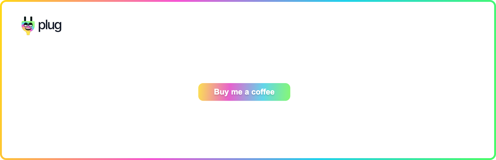
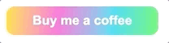
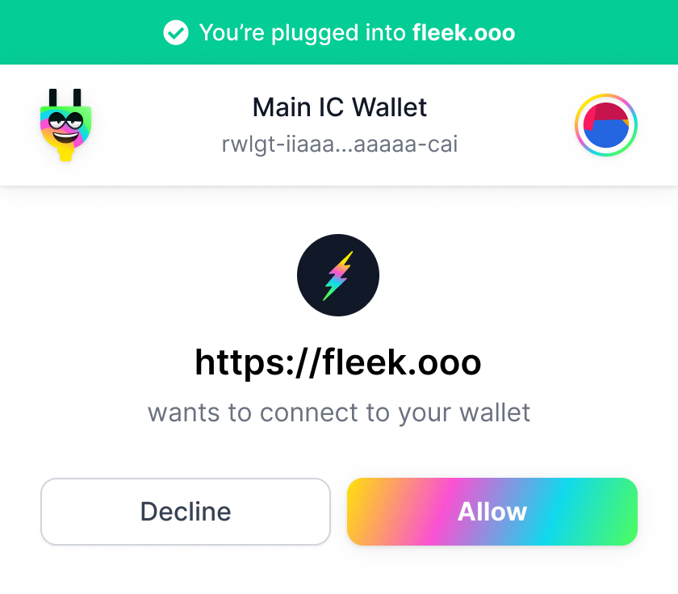
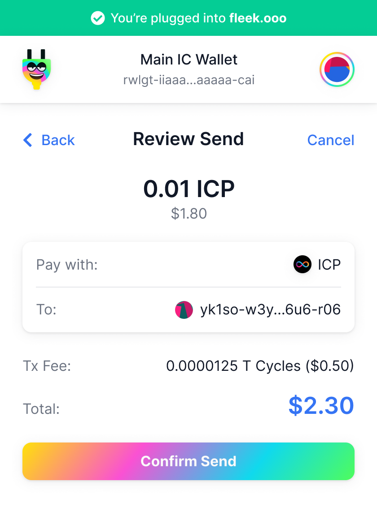

# Building an App example - Buy me a Coffee



We're going to build a very simple application called "Buy me a coffee".

A simple button that when pressed, requests a connection to the Plug wallet and a transfer!

A [live demo](http://demo.plugwallet.ooo/buy-me-a-coffee?id=xxx&amount=yyy) is available but make sure to replace the url parameters in the address bar with your desired values for testing! If you're clueless, learn more [here](#live-demo).

## Requirements 🤔

The guide assumes you have some basic knowledge of HTML, CSS and Javascript, we'll keep it easy!

It's recommended to read the [Getting started](/getting-started/connect-to-plug/) guide before you dive into the examples, as it gives you an overview of how Plug works.

Make sure you use a code editor, such as [Visual Studio Code](https://code.visualstudio.com/) or [Sublime text](https://www.sublimetext.com/), for editing the source-code!

## Scaffolding 🏗

Just like a real scaffolding in a building construction site, let's create a quick structure for our project, the skeleton for our application!

We're going to write a simple [HTML](https://developer.mozilla.org/en-US/docs/Learn/Getting_started_with_the_web/HTML_basics) structure for a page, where we'll show the "Buy me a coffee" button.

Start by creating a project directory in your operating system, for example, a directory called `Plug-buy-me-coffee` in your [home directory](https://en.wikipedia.org/wiki/Home_directory), or your favourite project directory.

In the project directory, create a new file named `index.html`, with the following content and save it! 

```html
<html>
  <head>
    <title>Buy me a coffee</title>
    <!-- App stylesheet (decoration, styles) -->
    <!-- App javascript (functionality, logic) -->
  </head>
  <body>
    <!-- App container (button) -->
  </body>
</html>
```

We'll substitute the comments by the actual implementation, ordered by simplicity:

  - [Application structure](#application-structure) (html)
  - [Custom styles](#custom-styles) (css)
  - [Call-to-action](#call-to-action) (javascript)
  - [Plug implementation](#plug-implementation) (javascript, Plug API)

With that said, let's get our hands dirty and start coding!


## Application structure 🚧

Open and edit the file `index.html` replacing the `<!-- App container (button) -->` comment with our desired application structure, as follows:

```html
<html>
  <head>
    <title>Buy me a coffee</title>
    <!-- App stylesheet (decoration, styles) -->
    <!-- App javascript (functionality, logic) -->
  </head>
  <body>
    <div id="app">
      <button id="buy-me-coffee">Buy me a coffee</button>
    </div>
  </body>
</html>
```

Open the `index.html` file in the browser or refresh the page as you go to see the changes!

## Custom styles 👄

Create a new file named `main.css` in the project directory to add custom styles for the app:

- Title colour
- Button size
- etc

Open and edit the file `index.html` replacing the `<!-- App stylesheet (decoration, styles) -->` comment with a link to our external stylesheet file we have just created, as follows:

```html
<html>
  <head>
    <title>Buy me a coffee</title>
    <link rel="stylesheet" href="main.css">
    <!-- App javascript (functionality, logic) -->
  </head>
  <body>
    <div id="app">
      <button id="buy-me-coffee">Buy me a coffee</button>
    </div>
  </body>
</html>
```

Open end edit the stylesheet file `main.css` and add some custom styles.

Let's say that we make the button super colourful like Plug, so copy the following content to the `main.css` and save it:

```css
#buy-me-coffee {
  border: none;
  font-style: normal;
  font-weight: bold;
  font-size: 16px;
  line-height: 24px;
  background: linear-gradient(94.95deg, #FFE701 -1.41%, #FA51D3 34.12%,
  #10D9ED 70.19%, #52FF53 101.95%);
  border-radius: 10px;
  color: #fff;
  padding: 6px 32px;
  cursor: pointer;
  transition: opacity 0.3s ease-in, transform 0.3s ease-in-out;
  transform: scale(1);
}

#buy-me-coffee:hover {
  opacity: 0.94;
  transform: scale(1.02);
}
```

Once you refresh the page, it should look like example below, a colourful [call-to-action](#call-to-action).

We'll implement the action next!

{: style="max-width:480px"}

Feel free to edit `main.css` and change the styles to your liking! For example, change the container to center the button verticaly and horizontaly:

```css
#app {
  display: flex;
  align-items: center;
  justify-content: center;
  width: 100%;
  height: 100%;
}
```

## Call-to-action 🏃🏽‍♀️

We are now going to create our main javascript file where we'll implement the `call-to-action`.

Create a file named `app.js` in the project directory. This is where we'll put our implementation code to handle the requests via the [Plug's](/getting-started/connect-to-plug/) application programming interface ([API](https://en.wikipedia.org/wiki/API)), as described in the [Getting started guide](/getting-started/connect-to-plug/).

As an initial placeholder, let's add a "mouse-click" event listener to the `call-to-action` that'll show an alert!

```js
// Initialises the application listeners and handlers
function main() {
  const button = document.querySelector('#buy-me-coffee');
  button.addEventListener("click", onButtonPress);
}

// Button press handler
function onButtonPress() {
  alert("Buy me a coffee button was pressed!")
}

// Calls the Main function when the document is ready
document.addEventListener("DOMContentLoaded", main);
```

Here's a simple breakdown of what it does:

- Awaits for the document to be ready
- Calls the `main` function
- Adds a listener to the button `#buy-me-coffee`
- When `clicked` calls the function `onButtonPress`

Link the `app.js` file to the `index.html` for this to work!

Open and edit the file `index.html`, replacing the `<!-- App javascript (functionality, logic) -->` with a link to our javascript file `app.js`, as follows:

```html
<html>
  <head>
    <title>Buy me a coffee</title>
    <link rel="stylesheet" href="main.css">
    <script type="text/javascript" src="app.js"></script>
  </head>
  <body>
    <div id="app">
      <button id="buy-me-coffee">Buy me a coffee</button>
    </div>
  </body>
</html>
```

After you save the changes, refresh the page and press the `Buy me a coffee` button. You'll get an alert with the message `Buy me a coffee button was pressed!`.

We can now proceed and implement the Plug processes in the function body `onButtonPress`.

## Plug implementation 👷🏻‍♀️

Open the file `app.js` in your code editor and edit the `onButtonPress` function body, as we want to write the logic to request a transfer of a certain amount via the Plug extension API.

We can break it down in the following steps:

- [Detect the Plug extension](#detect-the-plug-extension)
- [Check balance](#check-balance)
- [Request to transfer](#request-to-transfer)
- On success or error, display a message

## Detect the Plug extension 🔎

Firstly, we check if the end-user has the Plug extension in the current browser, as documented in the [Getting started guide](/getting-started/connect-to-plug/). 

Notice that we make the function [asynchronous](https://developer.mozilla.org/en-US/docs/Web/JavaScript/Reference/Statements/async_function), as we're dealing with a network request, which is resolved at anytime in the future and as such, a response we need to await.

Edit the function body for `onButtonPress` and replace the `alert` placeholder with:

```js
async function onButtonPress() {
  const hasAllowed = await window.ic.plug.requestConnect();

  if (hasAllowed) {
    console.log('Plug wallet is connected');
  } else {
    console.log('Plug wallet connection was refused')
  }
}
```

!!! Important

    So far, we've been opening the local `index.html` file in the web browser for your easiness!

    It works because opening html files in a browser, computes what the html file is describing and display the content correctly. But there are [browser security restrictions](https://en.wikipedia.org/wiki/Browser_security), that prevent us to make browser extension requests from local files.

    For this reason, you'll need to serve the project through a local http server!

## Http Server 🤖

There are plenty of options on how to serve projects locally and you are free to pick whatever suits you best!

If you're clueless, the quickest you can get a http server running in your local machine, is to first install [Nodejs]((https://nodejs.org/en/download/)) - a program that executes javascript outside the browser, that let us run scripts such as a `http server`, etc.

You can find the instructions for your operating system [here](https://nodejs.org/en/download/). Once [Nodejs](https://nodejs.org/en/download/) is installed and available in your system, install the [Http-server](https://www.npmjs.com/package/http-server) package, as an example.

Open your terminal and execute the following:

```sh
npm install --global http-server
```

Once the [Http-server](https://www.npmjs.com/package/http-server) package is installed, `cd` to the project directory in your terminal and run the following command (the dot represents the current directory):

```sh
http-server .
```

Open the browser that has the Plug extension installed and visit one of the addresses in your http server output:

```sh
Starting up http-server, serving .
Available on:
  http://127.0.0.1:8080
  http://xxx.xxx.x.xx:8080
```

Let's do a small test and inspect the data in the `developer console`.

Open the `developer console` in the browser to see the application script outputs, (here's an example for [Chrome](https://developer.chrome.com/docs/devtools/open/) and [Firefox](https://developer.mozilla.org/en-US/docs/Tools/Browser_Console)).

Press the `Buy me a Coffee` button and the `Plug` notification window should pop-up.

{: style="max-width:360px"}

Choose one of the options `Allow` or `Decline` and find the correspondent output in the console: `Plug wallet is connected` or `Plug wallet connection was refused`.

## Call-to-action locking 🔒

To complete, ensure that the button is disabled through the Plug wallet request duration, to prevent multiple concurrent requests.

Here's a breakdown of our intent:

- Modify the `onButtonPress` to take a parameter `el`
- Pass the DOM button element as an argument during runtime
- Reset the `disabled` button property after 5 seconds

We give 5 seconds because we want to provide enough time to the end-user to read the text.

```js
async function onButtonPress(el) {
  el.target.disabled = true;

  const hasAllowed = await window.ic.plug.requestConnect();

  if (hasAllowed) {
    console.log('Plug wallet is connected');
  } else {
    console.log('Plug wallet connection was refused')
  }

  setTimeout(function () {
    el.target.disabled = false;
  }, 5000);
}
```

Feel free to use your own custom values or implementation!

## Check balance 💸

To keep things easy, let's say that a Coffee is the equivalent of `0.04` ICP or `4000000` (fractional units of ICP tokens, called [e8s](https://sdk.dfinity.org/docs/token-holders/self-custody-quickstart.html)).

Add the amount at the top of the `app.js` file!

```js
const coffeeAmount = 4000000;
```

You can make the amount more readable by spliting the zero's by groups using an underscore:

```js
const coffeeAmount = 4_000_000;
```

Finally, we check if the user has enough balance before proceeding to the last step and request the transfer.

We'll also change the button text in each state change to improve the user experience.

{: style="max-width:480px"}

```js
async function onButtonPress() {
  el.target.disabled = true;

  const hasAllowed = await window.ic?.plug?.requestConnect();

  if (hasAllowed) {
    el.target.textContent = "Plug wallet is connected";

    const requestBalanceResponse = await window.ic?.plug?.requestBalance();

    const balance = requestBalanceResponse[0]?.value;

    if (balance >= coffeeAmount) {
      el.target.textContent = "Plug wallet has enough balance";
    } else {
      el.target.textContent = "Plug wallet doesn't have enough balance";
    }
  } else {
    el.target.textContent = "Plug wallet connection was refused";
  }

  setTimeout(function () {
    el.target.disabled = false;
  }, 5000);
}
```

!!! Important

      As described in the [Getting started](/getting-started/connect-to-plug/), the asynchronous method
      **requestBalance** response data is an array, as such, we pick the first result value that is an object type and get the value of the field name "value" of the object.

If you're not familiar with the question mark in `window.ic?.plug?.requestBalance`, don't be worried as that's syntax sugar to help us access nested properties, read more about optional chaining [here](https://developer.mozilla.org/en-US/docs/Web/JavaScript/Reference/Operators/Optional_chaining).

Save the file, refresh the page and press the `Buy me a Coffee` button!

You should see the correspondent message to your account balance: `Plug wallet has enough balance` or `Plug wallet doesn't have enough balance`.

## Request to transfer ❓

Continue editing the `app.js` file.

In the "has enough balance" block, make the `requestTransfer` call, that requires us to pass an argument to the function, that is an object with required fields `to` and `amount`, as described in our [Getting started](/getting-started/connect-to-plug/).

```js
const requestTransferArg = {
  to: receiverAccountId,
  amount: coffeeAmount,
};

const transfer = await window.ic?.plug?.requestTransfer(requestTransferArg);
```

When the `requestTransfer` is called, the `Plug` pop-up will show the panel:

{: style="max-width:360px"}

As we go, the button text is updated according to the transfer result state. When complete, we reset the Button to have the original text `Buy me a coffee`.

```js
async function onButtonPress(el) {
  el.target.disabled = true;

  const hasAllowed = await window.ic?.plug?.requestConnect();

  if (hasAllowed) {
    el.target.textContent = "Plug wallet is connected"

    const balance = await window.ic?.plug?.requestBalance();

    if (balance >= coffeeAmount) {
      el.target.textContent = "Plug wallet has enough balance"

      const requestTransferArg = {
        to: 'xxxxx',
        amount: coffeeAmount,
      };
      const transfer = await window.ic?.plug?.requestTransfer(requestTransferArg);

      const transferStatus = transfer?.transactions?.transactions[0]?.status;

      if (transferStatus === 'COMPLETED') {
        el.target.textContent = `Plug wallet transferred ${coffeeAmount} e8s`;
      } else if (transferStatus === 'PENDING') {
        el.target.textContent = "Plug wallet is pending.";
      } else {
        el.target.textContent = "Plug wallet failed to transfer";
      }
    } else {
      el.target.textContent = "Plug wallet doesn't have enough balance";
    }
  } else {
    el.target.textContent = "Plug wallet connection was refused";
  }

  setTimeout(() => {
    el.target.disabled = false;
    el.target.textContent = "Buy me a coffee"
  }, 5000);
}
```

Save the changes, refresh the browser and play with it!

If everything's done correctly you should have a working application, that connects to Plug and makes a transfer.

Hope you enjoyed the read this far and got to build a simple application with Plug!

## Live demo 🎁

A [live demo](http://demo.plugwallet.ooo/buy-me-a-coffee?id=xxx&amount=yyy) is available but make sure to replace the url parameters in the address bar with your desired values for testing!

If you're clueless, here's an example where the `id` and `amount` are replaced:

- http://demo.plugwallet.ooo/buy-me-a-coffee?id=xxx&amount=yyy
- http://demo.plugwallet.ooo/buy-me-a-coffee?id=893jk-u41jaz-439xx&amount=2000000

The id should be a valid Principal or Address id, the amount in ([e8s](https://sdk.dfinity.org/docs/token-holders/self-custody-quickstart.html)) and you'll have to open or refresh the page after the changes!

## Project source-code ⚙️

The source-code for this guide can be found in our [examples](https://github.com/Psychedelic/plug-docs/tree/main/examples/buy-me-a-coffee).

