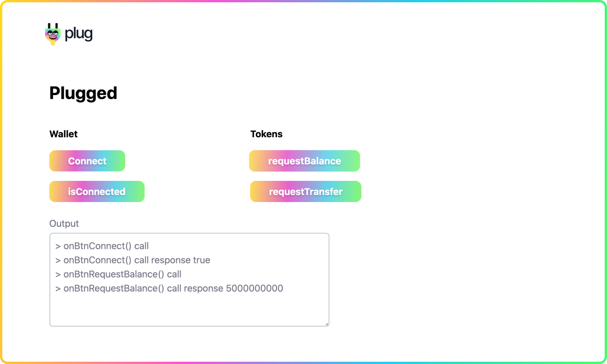
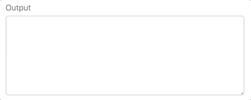

# Plugged



The application we are going to build today is called **Plugged**, a simple application that provides a list of buttons to trigger actions to interact with the Plug extension.

A [live demo](http://demo.plugwallet.ooo/plugged/) is available, use the input fields to place your desired values 🎁 for testing!

## Requirements 🤔

The guide assumes you have some basic knowledge of HTML, CSS and Javascript, we promise to keep it simple!

It's recommended to read the build example [Buy me a Coffee](build-app-buy-me-a-coffee.md) guide before as it provides a simple example and helps install a [basic Http server](build-app-buy-me-a-coffee.md#http-server) in your local machine. 

We'll assume you have an HTTP Server installed and understand why you need it.

Make sure you use a code editor, such as [Visual Studio Code](https://code.visualstudio.com/) or [Sublime text](https://www.sublimetext.com/), for editing the source-code!

## Scaffolding 🏗

Create a new project directory, and name it accordingly, for example `Plugged`.

In the `Plugged` directory, create a new file named `index.html`.

```html
<html>
  <head>
    <title>Plugged</title>
    <!-- Stylesheets (css) -->
    <!-- Application logic (javascript) -->
  </head>
  <body>
    <!-- Application container -->
  </body>
</html>
```

Create two new files in the project directory, the `stylesheet` and the `javascript` files:

- main.css
- app.js

Replace each comment in the `index.html`, linking to the respective source file and save it!

```html
<html>
  <head>
    <title>Plugged</title>
    <link rel="stylesheet" href="main.css">
    <script type="text/javascript" src="app.js"></script>
  </head>
  <body>
    <!-- Application container -->
  </body>
</html>
```

## Application structure 🚧

As we can see in the top screenshot for the project look, we have the following structure:
- Title at the top
- Three row like containers
  - The first for user input
  - The second for all the button columns
  - The third for the output console

```html
<div id="app">
  <!-- Title -->
  <h1>Plugged</h1>
  <!-- Row like container for user input -->
  <!-- Row like container for the button columns -->
  <div>
    <!-- Column for Wallet buttons -->
    <!-- Column for Token buttons -->
  </div>
  <!-- Row like container for the output console -->
</div>
```

We're going to replace the comments with the required structure, as we go!

## Custom styles 👄

To avoid [boilerplate code](https://en.wikipedia.org/wiki/Boilerplate_code), we're going to add an [utility first](https://tailwindcss.com/docs/utility-first) **[css library](https://en.wikipedia.org/wiki/CSS_framework)** from an external provider, to help us style and structure the application quickly.

There are plenty of options, but as an example we're going to use [Tailwindcss](https://tailwindcss.com/), feel free to style yours with a different approach of your liking.

Make the following changes in the `index.html` by adding the `tailwindcss` base and main stylesheets:

```html
<html>
  <head>
    <title>Plugged</title>
    <link
      rel="stylesheet"
      href="https://cdnjs.cloudflare.com/ajax/libs/tailwindcss/2.2.4/base.min.css"
    />
    <link
      rel="stylesheet"
      href="https://cdnjs.cloudflare.com/ajax/libs/tailwindcss/2.2.4/tailwind.min.css"
    />
    <link rel="stylesheet" href="main.css">
    <script type="text/javascript" src="app.js"></script>
  </head>
  <body>
    <!-- Application container -->
  </body>
</html>
```

What we'll do from now is to pick class names described in the [Tailwindcss reference document](https://tailwindcss.com/docs/container) to style our application.

If interested, take some time to read through the documentation to find how to style the application to your taste. Or, feel free to create your own custom styles in the `main.css` file.

The following source-code is then a style suggestion, used as an example for the purpose of our guide.

In the `index.html` replace the comment `<!-- Application container -->` with:

```html
<div id="app" class="container mx-auto py-6 px-2 mt-20">
  <!-- Title -->
  <h1 class="text-3xl font-bold mb-10">Plugged</h1>
  <!-- Row like container for user input -->
  <div class="container space-y-4">
    <div>
      <label class="text-gray-500 mb-1 block">Send to address</label>
      <input id="receiver-principal-id" class="w-1/2 border-2 rounded-md border-gray-300 p-2" />
    </div>
    <div>
      <label class="text-gray-500 mb-1 block">Amount (e8s)</label>
      <input id="amount" class="w-1/2 border-2 rounded-md border-gray-300 p-2" />
    </div>
  </div>
  <!-- Row like container for the button columns -->
  <div class="grid grid-cols-3 gap-4 pb-6 mt-10">
    <!-- Column for Wallet buttons -->
    <div>
      <p class="text-base font-bold mb-4">Wallet</p>
      <div class="flex flex-col space-y-4">
        <div>
          <button
            id="btn-connect"
            class="
              btn
              transition
              duration-300
              bg-gray-300
              hover:bg-gray-100
              py-2
              px-6"
          >
            Connect
          </button>
        </div>
        <div>
          <button
            id="btn-is-connected"
            class="
              btn
              transition
              duration-300
              bg-gray-300
              hover:bg-gray-400
              py-2
              px-6"
          >
            isConnected
          </button>
        </div>
      </div>
    </div>
    <!-- Column for Token buttons -->
    <div>
      <p class="text-base font-bold mb-4">Tokens</p>
      <div class="flex flex-col space-y-4">
        <div>
          <button
            id="btn-request-balance"
            class="
              btn
              transition
              duration-300
              bg-gray-300
              hover:bg-gray-100
              py-2
              px-6"
          >
            requestBalance
          </button>
        </div>
        <div>
          <button
            id="btn-request-transfer"
            class="
              btn
              transition
              duration-300
              bg-gray-300
              hover:bg-gray-100
              py-2
              px-6
            "
          >
            requestTransfer
          </button>
        </div>
      </div>
    </div>
  </div>
  <!-- Row like container for the output console -->
</div>
```

In addition to the styles provided by the class names of `Tailwindcss`, we can create custom styles for our buttons. For example, we'll make it colorful by adding the following style in our `main.css` file:

```css
.btn {
  border: none;
  font-style: normal;
  font-weight: bold;
  font-size: 16px;
  line-height: 24px;
  background: linear-gradient(94.95deg, #FFE701 -1.41%, #FA51D3 34.12%,
  #10D9ED 70.19%, #52FF53 101.95%);
  border-radius: 10px;
  color: #fff;
  text-shadow: 0px 2px 3px rgb(0 0 0 / 16%);
  padding: 6px 32px;
  cursor: pointer;
  transition: opacity 0.3s ease-in, transform 0.3s ease-in-out;
  transform: scale(1);
}

.btn:hover {
  opacity: 0.94;
  transform: scale(1.02);
}
```

The sky is the limit, style the application as you like!

## Local server 🤖

Launch the [Http server](build-app-buy-me-a-coffee.md#http-server) as described in the [Buy me a coffee example](build-app-buy-me-a-coffee.md) to serve the `index.html` and open the address in the browser.

From then on, refresh the page to see new changes!

Open the terminal, `cd` to the project pathname `cd /project/pathname/` and serve from the project directory (the dot represents the current directory, which should be the location of the project):

```sh
http-server .
```

## Application logic 🧠

Open and edit the `app.js` file.

Start by writing the DOM selectors and assign each element to a list of elements (constant variable `els`):

```js
// Elements list
const els = {};

// Assign elements to the elements list
els.receiverPrincipalId = document.querySelector('#receiver-principal-id');
els.amount = document.querySelector('#amount');
els.btnConnect = document.querySelector('#btn-connect');
els.btnIsConnected = document.querySelector('#btn-is-connected');
els.btnRequestBalance = document.querySelector('#btn-request-balance');
els.btnRequestTransfer = document.querySelector('#btn-request-transfer');
```

Wrap the selector and element assignment in a function called `main` and run it once the DOM is ready, as we need to wait for it to render before executing the selectors to avoid `elements not found`.

```js
// Elements list
const els = {};

// Initialises the application listeners and handlers
function main() {
  // Assign elements to the elements list
  els.receiverPrincipalId = document.querySelector('#receiver-principal-id');
  els.amount = document.querySelector('#amount');
  els.btnConnect = document.querySelector('#btn-connect');
  els.btnIsConnected = document.querySelector('#btn-is-connected');
  els.btnRequestBalance = document.querySelector('#btn-request-balance');
  els.btnRequestTransfer = document.querySelector('#btn-request-transfer');
}

// Calls the Main function when the document is ready
document.addEventListener("DOMContentLoaded", main);
```

In the body of the function `main`, just after our selectors and `els` assignments, initialise the click listener for all our buttons.

The `addEventListener` requires an event name `e.g. click` and a callback function `e.g. onButtonPressHandler`.

Write a placeholder function called `onButtonPressHandler`, place it in the same scope or level as the function `main`.

Start by implementing a simple placeholder that shows an alert for now, we'll improve it shortly!

```js
function main () {
  // Assign elements to the elements list
  els.receiverPrincipalId = document.querySelector('#receiver-principal-id');
  els.amount = document.querySelector('#amount');
  els.btnConnect = document.querySelector('#btn-connect');
  els.btnIsConnected = document.querySelector('#btn-is-connected');
  els.btnRequestBalance = document.querySelector('#btn-request-balance');
  els.btnRequestTransfer = document.querySelector('#btn-request-transfer');
}

function onButtonPressHandler(el) {
  const name = el.target.id;
  alert(`The button ${name} was pressed!`);
}
```

In the body of the function `main`, just after the selectors, add the `click` event listeners, as follows:

```js
function main () {
  // Assign elements to the elements list
  els.receiverPrincipalId = document.querySelector('#receiver-principal-id');
  els.amount = document.querySelector('#amount');
  els.btnConnect = document.querySelector('#btn-connect');
  els.btnIsConnected = document.querySelector('#btn-is-connected');
  els.btnRequestBalance = document.querySelector('#btn-request-balance');
  els.btnRequestTransfer = document.querySelector('#btn-request-transfer');

  // Initialise click listener for buttons
  els.btnConnect.addEventListener('click', onButtonPressHandler);
  els.btnIsConnected.addEventListener('click', onButtonPressHandler);
  els.btnRequestBalance.addEventListener('click', onButtonPressHandler);
  els.btnRequestTransfer.addEventListener('click', onButtonPressHandler);
}
```

You can keep it a bit simpler writing it in a `declarative` or  in a more `functional` programming style, instead of the suggested code above that does it one-by-one.

The alternative goes through each `element` of the constant variable `els`, filters by asserting the type `button` and adds a `click` event listener!

Pick whichever style makes more sense to you!

```js
function main () {
  // Assign elements to the elements list
  els.receiverPrincipalId = document.querySelector('#receiver-principal-id');
  els.amount = document.querySelector('#amount');
  els.btnConnect = document.querySelector('#btn-connect');
  els.btnIsConnected = document.querySelector('#btn-is-connected');
  els.btnRequestBalance = document.querySelector('#btn-request-balance');
  els.btnRequestTransfer = document.querySelector('#btn-request-transfer');

  // Initialise click listener for buttons (alternative style)
  Object
    .values(els)
    .filter((el) => el.nodeName === 'BUTTON')
    .forEach((el) => el.addEventListener(
        'click',
        onButtonPressHandler
      )
    )
}
```

Save the changes and refresh the browser and click the buttons to trigger the alert message handled by the function `onButtonPressHandler`.

## Plug integration 👷🏻‍♀️

Open and edit the `app.js` file.

In the function `main` verify if the `Plug` extension is available, before proceeding.

For example, check if `Plug` window object is available at the very top of our `main` function body before the selectors and element assignment:

```js
if (!window?.ic?.plug) {
  alert("Plug extension not detected!");
  return;
}
```

The function `main` will exit immediately if the `Plug extension` is not detected. We'll improve the user-experience a bit by showing a message in the `Output` console shortly!

## Call-to-action handlers 📢

In the function `onButtonPressHandler` use a switch statement to treat each case separately:

- On `btn-connect` handle the Plug connection
- On `btn-is-connected` check the Plug connection state
- On `btn-request-balance` request the Plug wallet balance
- On `btn-request-transfer` request the Transfer

Here's how we wrote it:

```js
// Button press handler
function onButtonPressHandler(el) {
  const name = el.target.id;

  switch(name) {
    case 'btn-connect':
      alert("handle the Plug connection");
      break;
    case 'btn-is-connected':
      alert("check the Plug connection state");
      break;
    case 'btn-request-balance':
      alert("request the Plug wallet balance");
      break;
    case 'btn-request-transfer':
      alert("request the Transfer");
      break;
    default:
      alert('Button not found!');
  };
}
```

We now have to replace each alert we used as a placeholder by the actual implementation.

## Plug action implementations 👷🏻‍♀️

The `Plug` API is described in our [Getting started](/getting-started/connect-to-plug/) guide and since our calls happen in the Internet Computer network, we have to await for the calls to resolve, as we handle them [asynchronously](https://developer.mozilla.org/en-US/docs/Learn/JavaScript/Asynchronous).

Here's an example of an asynchronous function to handle the `btn-connect` button click. 

Add the function `onBtnConnect` to `app.js` at the same scope or level as the function `main`.

```js
function main() {
  // the main implementation
  // function body omitted on purpose
  // ...
}

// On button press connect handler
async function onBtnConnect() {
  const response = await window.ic?.plug?.requestConnect();
  console.log("Response for Plug requestConnect() is ", response);
}
```

Update the function `onButtonPressHandler` by replacing the `alert` in the switch case for `btn-connect` with the `onBtnConnect` call.

```js
// Button press handler
function onButtonPressHandler(el) {
  const name = el.target.id;

  switch(name) {
    case 'btn-connect':
      onBtnConnect();
      break;
    case 'btn-is-connected':
      alert("check the Plug connection state");
      break;
    case 'btn-request-balance':
      alert("request the Plug wallet balance");
      break;
    case 'btn-request-transfer':
      alert("request the Transfer");
      break;
    default:
      alert('Button not found!');
  };
}
```

Try to write the remaining button handlers on your own, by following the example above and checking the Plug extension API in the [Getting started](/getting-started/connect-to-plug/).

## Output console 🖥

Open and edit the `index.html` file.

We are going to create a new html component to place the output of our `Plug` interactions for a better user-experience.

Replace the comment at the bottom of our application html structure `<!-- Row like container for the output console -->` with the desired `Output` html structure.

The class names were picked from `tailwindcss`, feel free to customise these to your preference.

```html
<div class="container">
  <label
    class="
      text-gray-500
      mb-1
      block
    "
  >
    Output
  </label>
  <textarea
    id="output"
    class="
      h-40
      w-full
      border-2
      rounded-md
      border-gray-300
      p-2
    "
  ></textarea>
</div>
```

Open and edit the `app.js` file.

Add a new selector for `#output` and assign it to the `els`.

```js
els.output = document.querySelector('#output');
```

Ultimately, we want to have a function we can pass a message to, which writes to our `Output`, as described:

- Receives text as an argument
- Updates the element text content by adding a new line of text
- Scrolls to the bottom, as the text content increases

Very simple and useful to keep track of our `Plug` calls!

As an example, here's how such function might look like:

```js
// Write to the output DOM element
function outputWrite(text) {
  els.output.textContent += (els.output.textContent ? `\n` : '') + `> ${text}`;
  els.output.scrollTop = els.output.scrollHeight;
}
```

Place the function `outputWrite` at the bottom of the `app.js` file.

Make `outputWrite` calls wherever there's state change and a desired computation output.

To exemplify, let's keep track of our Plug `requestConnect` in the function `onBtnConnect`:

```js
async function onBtnConnect() {
  outputWrite('onBtnConnect() call');
  const response = await window.ic?.plug?.requestConnect();
  outputWrite(`onBtnConnect() call response ${response}`);
}
```

Save the changes, refresh the browser and play with it, you should now see the messages in the `Output` component!

{: style="max-width:480px"}

Hope you enjoyed the read this far and got to build a very simple application with Plug!

## Project source-code ⚙️

The source-code for this guide can be found in our [examples](https://github.com/Psychedelic/plug-docs/tree/main/examples/plugged).

