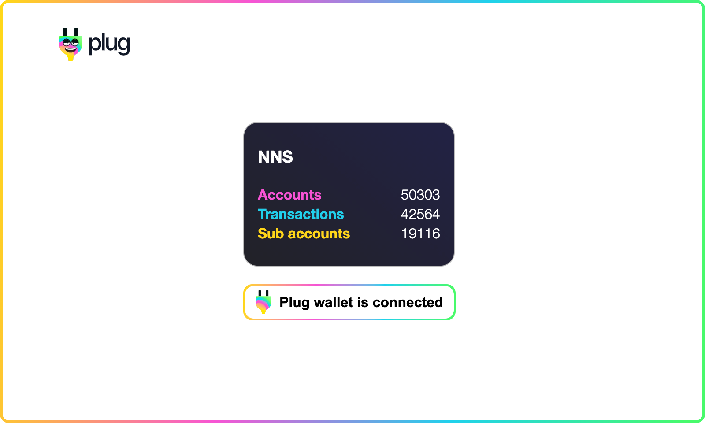

# NNS Stats App



The application we are going to build today is a  **Plug authentication example, with the NNS canister**, a simple application that provides some stats from the [NNS/UI Canister](https://nns.ic0.app/).

This app showcases how Plug can be used to authenticate a user, and have that user's identity interact with an app's canisters (making proxy signed calls through Plug).

## Requirements 🤔

The guide assumes you have read the [Getting started](/getting-started/connect-to-plug/), completed the [Buy me a Coffee](build-app-buy-me-a-coffee.md) and 
[Plugged](plugged.md)!

As such, we'll assume you know how to execute certain commands, how to run a basic HTTP Server, and few other things.

If you haven't, complete them first and only after follow this guideline!

## Boilerplate 🏗

We're going to provide the boilerplate code, as we expect you to have completed the basic tutorials for [Buy me a Coffee](build-app-buy-me-a-coffee.md) and [Plugged](plugged.md). The idea is to skip the basics!

In the project directory, create a new file named `index.html` and copy and paste the following content:

```html
<html>
  <head>
    <title>Plug Authentication for NNS</title>
    <link rel="stylesheet" href="main.css">
    <script type="text/javascript" src="candid.js?202107281700"></script>
    <script type="text/javascript" src="app.js?202107281700"></script>
  </head>
  <body>
    
    <div id="app">
      <div>
        <div id="nns-stats-container" class="hidden">
          <h3>Plug Authentication for NNS</h3>
          <div>
            <label>Accounts</label>
            <span id="accounts_count"></span>
          </div>
          <div>
            <label>Transactions</label>
            <span id="transactions_count"></span>
          </div>
          <div>
            <label>Sub accounts</label>
            <span id="sub_accounts_count"></span>
          </div>
        </div>
        <div>
          <button id="button-connect" class="button-rainbow">
            <div class="button-container">
              
              <span id="btn-title">Connect with Plug</span>
            </div>
          </button>
        </div>
      </div>
    </div>
  </body>
</html>
```

!!! Note

    The YYYYMMDDHHSS in the script source is used to trick the browser cache. Change the value if you find persistent cache when following the tutorial.

Create the stylesheet file named `main.css` and copy and paste the following content:

```css
#app {
  display: flex;
  align-items: center;
  justify-content: center;
  width: 100%;
  height: 100%;
  font-family: "HelveticaNeue-Light", "Helvetica Neue Light", "Helvetica Neue", Helvetica, Arial, "Lucida Grande", sans-serif;
  line-height: 1.4;
}

#logo {
  width: 80px;
  position: absolute;
  padding: 20px;
  top: 0;
  left: 0;
}

#btn-title {
  font-weight: 600;
}

.button-rainbow {
  border: none;
  background: linear-gradient(93.07deg, #FFD719 0.61%, #F754D4 33.98%, #1FD1EC 65.84%, #48FA6B 97.7%);
  padding: 2px;
  border-radius: 10px;
  cursor: pointer;
  transition: transform 0.3s;
  transform: scale(1) translate3d( 0, 0, 0) perspective(1px);
}

.button-rainbow:hover {
  transform: scale(1.04) translate3d( 0, 0, 0) perspective(1px);
}

.button-container {
  display: flex;
  flex-direction: row;
  align-items: center;
  background: white;
  padding: 5px 12px;
  border-radius: 10px;
  font-size: 16px;
  font-weight: 600;
}

.dark {
  background: #111827;
  color: white;
}

.plug-icon {
  margin-right: 9px;
}

#nns-stats-container {
  max-width: 400px;
  border: 1px solid #bbb;
  border-radius: 16px;
  box-sizing: border-box;
  padding: 0.4rem 1rem;
  margin-bottom: 20px;
  background: linear-gradient(39deg, rgba(34,34,40,1) 0%, rgba(34,34,51,1) 40%, rgba(34,34,67,1) 94%);
  color: #fff;
}

#nns-stats-container > div {
  display: flex;
  flex-flow: row;
  justify-content: space-between;
}

#nns-stats-container > div label {
  font-weight: bold;
}

#nns-stats-container > div:nth-child(2) label {
  color: #F754D4;
}

#nns-stats-container > div:nth-child(3) label {
  color: #1FD1EC;
}

#nns-stats-container > div:nth-child(4) label {
  color: #FFD719;
}

#nns-stats-container > div:last-child {
  margin-bottom: 20px;
}

.hidden {
  display: none;
}
```

Create a the file `app.js` and keep it simple for now, as we'll go through the process together!

```js
// Elements list
const els = {};

// Initialises the application listeners and handlers
function main() {
  els.btnTitle = document.querySelector('#btn-title')
  els.nnsStatsContainer = document.querySelector('#nns-stats-container');
  els.button = document.querySelector('#button-connect');
  els.button.addEventListener("click", onButtonPress);
}

// Button press handler
async function onButtonPress(el) {
  const hasAllowed = await window.ic?.plug?.requestConnect();

  if (!hasAllowed) {
    els.btnTitle.textContent = "Plug wallet connection was refused";
    return;
  }

  els.btnTitle.textContent = "Plug wallet is connected";
}

// Calls the Main function when the document is ready
document.addEventListener("DOMContentLoaded", main);
```

## Local server 🤖

Launch the [Http server](build-app-buy-me-a-coffee.md#http-server) as described in the [Buy me a coffee example](build-app-buy-me-a-coffee.md) to serve the `index.html` and open the address in the browser.

From then on, refresh the page to see our boilerplate!

```sh
http-server .
```

## Application logic 🧠

We're going to use the Plug connection to authenticate a user and have the user's identity to interact with the [NNS/UI Canister](https://nns.ic0.app/), to simplifly the cumbersome process that is otherwise required.

To summarize, we'll break it down to the following steps:

- [Request a connection](#request-a-connection) to interact with the Internet Computer via Plug
- [Create an Actor](#create-an-actor) to interact with the Canister
- [Consume the Canister endpoint data](#consume-the-canister-endpoint-data)

## Request a connection 🔌

An Agent is required to talk to the Canister.

In the `app.js` we'll call the `requestConnect` by passing a whitelist (a list of allowed Canister ids) that instantiates the agent once the request is granted.

Before we do the request, create the whitelist at the top of the file, at the same level or scope of `main`:

```js
// Canister Ids
const nnsCanisterId = 'qoctq-giaaa-aaaaa-aaaea-cai'

// Whitelist
const whitelist = [
  nnsCanisterId,
];

function main() {
  // Intentionally omitted
  // ...
}

async function onButtonPress(el) {
  // Intentionally omitted
  // ...
}
```

We use a single Canister id to represent the `NNS/UI` in our whitelist.

In the body of the function `onButtonPress` make the `requestConnect` call passing the `whitelist`, as follows:

```js
async function onButtonPress(el) {
  const isConnected = await window.ic?.plug?.requestConnect({
    whitelist,
  });

  if (!isConnected) {
    els.btnTitle.textContent = "Plug wallet connection was refused";
    return;
  }

  els.btnTitle.textContent = "Plug wallet is connected";

  if (!window.ic.plug?.agent) {
    els.btnTitle.textContent = "Oops! Failed to initialise the Agent...";
    return;
  }
}
```

Once the agent is instantianted, the property `agent` is populated in the window Plug object (e.g. `window.ic.plug.agent`). 

For the available methods, see the public methods in the **@dfinity/agent** [HTTP](https://github.com/dfinity/agent-js/blob/main/packages/agent/src/agent/http/index.ts) implementation source-code.


!!! Important
    
    The version used in the Plug extension might [differ](https://github.com/Psychedelic/plug-inpage-provider/blob/d64123c/package.json#L59), so make sure you check the versions in the production versions in use.


## Create an actor 🧑‍🎨

To make interactions to the target NNS/UI Canister we need an [Actor](https://sdk.dfinity.org/docs/language-guide/actors-async.html).

Open the `app.js` to edit the body of `onButtonPress`.

The `Actor` represents the Canister we want to interact with via the [Candid](https://sdk.dfinity.org/docs/candid-guide/candid-concepts.html) (interface description language). Here's an example for the NNS/UI Candid [file](https://github.com/dfinity/nns-dapp/blob/cd755b8/canisters/nns_ui/nns_ui.did).

When calling `createActor` we pass the following arguments:

- The Canister Id
- The Interface Factory (a function that creates the IDL object)

Once instantiated, we get an Actor object as the return value.

```js
const actor = await window.ic.plug.createActor({
  canisterId: nnsCanisterId,
  interfaceFactory: nnsUi,
});
```

The interface factory can be obtained by using the Candid [tools](https://github.com/dfinity/candid#tools), instead of writting it manually.

Here's an example of how you'd generate the interface factory for the `nns_ui.did`:

```sh
didc bind nns_ui.did -t js > nns_ui.did.js
```

Similarly, Typescript type definitions can be created by:

```sh
didc bind nns_ui.did -t ts > nns_ui.did.d.ts
```

!!! Note

    This project provides the interface factory, so you don't have to generate it. Although, it's recommended to try generating it yourself for the learning experience!

At this point, the `onButtonPress` source-code should be inline with:

```js
async function onButtonPress(el) {
  const hasAllowed = await window.ic?.plug?.requestConnect({
    whitelist,
  });

  if (!hasAllowed) {
    els.btnTitle.textContent = "Plug wallet connection was refused";
    return;
  }

  els.btnTitle.textContent = "Plug wallet is connected";

  if (!window.ic.plug?.agent) {
    els.btnTitle.textContent = "Oops! Failed to initialise the Agent...";
    return;
  }
}
```

You'll notice that we only interrupt the application flow on error, or failure. We'd need to reset to the initial state (e.g. the button text should not show an error message).

## Consume the Canister endpoint data 🍩

As described in the NNS/UI Candid [file](https://github.com/dfinity/nns-dapp/blob/cd755b8/canisters/nns_ui/nns_ui.did), we have a list of available methods and we'll use the `get_stats` to get some data:

```js
async function onButtonPress(el) {
  const hasAllowed = await window.ic?.plug?.requestConnect({
    whitelist,
  });

  if (!hasAllowed) {
    els.btnTitle.textContent = "Plug wallet connection was refused";
    return;
  }

  els.btnTitle.textContent = "Plug wallet is connected";

  if (!window.ic.plug?.agent) {
    els.btnTitle.textContent = "Oops! Failed to initialise the Agent...";
    return;
  }

  const NNSUiActor = await window.ic.plug?.createActor({
    canisterId: nnsCanisterId,
    interfaceFactory: nnsUi,
  });

  // Terminate on NNS Actor initialisation failure
  if (!NNSUiActor) {
    els.btnTitle.textContent = "Oops! Failed to initialise the NNS Actor...";
    return;
  }

  const stats = await NNSUiActor?.get_stats();
  console.log('NNS stats', stats);

  if (!stats) {
    els.btnTitle.textContent = "Oops! Failed to get the NNS Stats...";
    return;
  }
}
```

The process is very simple and at this point you should see the available data in the developer console!

## Conclusion ✅

Now that we have data, we can pass it to the UI. So, add these the implementation after the `get_stats` response clause.

Here's a simple example of how to do it for the `#accounts_count` HTML node, where after we reveal the UI Stats container:

```js
els.nnsStatsContainer.querySelector('#accounts_count').textContent = Number(stats.accounts_count);

els.nnsStatsContainer.classList.remove('hidden');
```

Complete the process by providing the remaining HTML nodes (e.g. transactions_count, etc) with the correct data.

Find them in the file `index.html` and update your `onButtonPress` implementation.

## Plug action implementations 👷🏻‍♀️

Hope you enjoyed the read this far and got to build a very simple application with Plug!

## Project source-code ⚙️

The source-code for this guide can be found in our [examples](https://github.com/Psychedelic/plug-docs/tree/main/examples/plug-authentication-nns).

