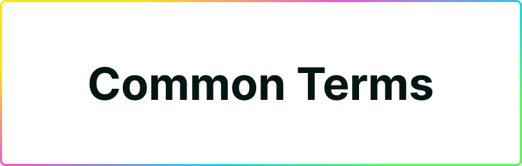

# Common Terms

Here's a quick dictionary for terms you might encounter while using, integrating, or interacting with Plug.

-----

### Wallet
- The interface you use to surface your Principal ID account and balances.
- In this case, the Plug browser extension; on Ethereum, MetaMask would be one.

### Account
- An account in Plug is comprised by a `Principal ID (public)`, and a `Seed Phrase or Private Key`. Or, as it is known, a private-public key pair.
- Your account is both your wallet, and your identity for IC applications.
- It holds token balances, referenced from their respective ledgers.
- Plug can create one account for you, giving you a `Principal ID`.
- But you can import an existing one from a `Seed Phrase or Private Key`.
- When connected to Plug, the extension protects your account with a password.

### Principal ID (Public Key)
- A user's main identifier on the Internet Computer.
- Your  **wallet address** in Plug, used to surface balances and authenticate.
- It's an **identifier** you can use to sign into Internet Computer apps.
- Also could be mentioned as **public key** or **address**.
- On the Internet Computer, they look like:
- `uncuj-asqp4-whsw6-tcfcz-es7ur-jutew-6oi3s-zti6i-bxxfp-zosth-gae`

### Private Key
- The private key of the key pair that makes your account.
- You use it to **sign and authorize** operations in your behalf.
- Your private key is used to generate your recovery Seed Phrase.
- You must **not share it in any way with anyone**.

### Seed Phrase
- A mnemonic phrase version of your account's Private Key.
- Composed by 12-words in a specific order that represent your Private Key.
- They are used to **recover or import** your Principal ID / Dank Account.
- If your computer dies, is lost, or you lose your session, you can restore it with this.
- Example: `table birds have paper granola furniture football country mercury genesis soup holder`
- You need to **write it down** and store it somewhere safe. Don't share it.

### ICP
- The main utility and governance token of the Internet Computer
- Allows holders to lock them in the Network Nervous System (NNS) to create "Neurons" (another IC token) that can vote in the NNS governance algorithm system in charge of the IC and its economics.
- **Can be swapped for Cycles** (another IC token), currently the only way to create them.
- In Plug you can make ICP deposit into your account from external sources.
- Read [this post](https://medium.com/dfinity/the-internet-computers-token-economics-an-overview-29e238bd1d83#:~:text=ICP%20tokens%20allow%20users%20to,proposals%20and%20earn%20voting%20rewards.) to learn more about them.

### Cycles
- Cycles are another Internet Computer token that represents computational power.
- You burn it to use that computational power and memory to power canisters and the software in them.
- They can only be created from **ICP**.
- You can send cycles to other Plug/Dank users, or to canisters.
- You can deposit cycles from external sources to your account in Plug.

### Canisters
- Canisters are computational units that can hold both program and state.
- It's where all code, data, and software lives and is executed on the Internet Computer.
- They are powered by burning Cycles, which represent computational power they can use on the network.
- You can build frontends, backends, apps, services, ledgers, databases, or anything in them.
- Think **Smart Contracts** on Ethereum, but evolved to hold entire software services.
- They are **tamper-proof** and governed by the Internet Computer Protocol.
- Learn more about them [in this article](https://medium.com/dfinity/the-internet-computers-token-economics-an-overview-29e238bd1d83#:~:text=ICP%20tokens%20allow%20users%20to,proposals%20and%20earn%20voting%20rewards.).

### Charging Stations
- Charging Stations are a type of canister on the Internet Computer.
- Their purpose is to **refill canisters with cycles** to fund their functioning.
- They can be configured to do so in a **smart and programmatic way**.