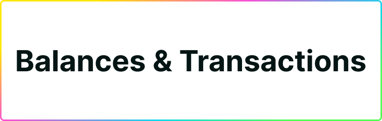

## Alpha Wallet Connect

### Disclaimer

We are releasing the alpha version of wallet connect for Plug Mobile. This feature enables the developers to provide another way of connecting to their dApps and for users to enjoy the ecosystem directly from their phones. The alpha version is aimed toward the developers to have time to test how the integration works and make the (minor) changes needed to make it work with their dApps. 
We expect to find problems on the implementation so if you are a user you can download the APK but use it at your own risk.

### Introduction

The alpha wallet connect comes with 3 packages

- Alpha Android APK
- Alpha inpage provider
- Plug Connect button

In the Alpha Android APK and the Alpha inpage provider is the logic for the communication between the web application and the mobile application. Also we created a new version of the Plug Connect Button that will handle the logic that differentiates mobile users from web users. In case you are not using the Plug Connect button you need to add this logic in your application.

### Installing Wallet Connect

[IMPORTANT] **First test this in a testing environment**

To add wallet connect into your application you need to follow the following steps

1. Update the inpage provider to the alpha version.
3. Update the Plug Connect button to the alpha version.
4. Install the Alpha Android APK in a phone and go to the dapp in the browser.
5. Connect to the application using the Plug Alpha Android app.
6. If you dont use Plug Connect button, add code to your plug connection logic  

    ```js
        var=1
    ```
    
Make sure you to come by our [Discord](https://discord.gg/yVEcEzmrgm) for any feedback or help with the implementation.