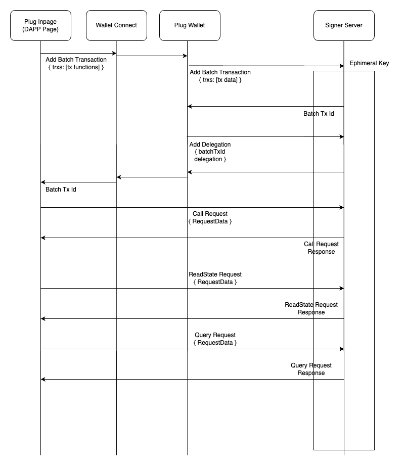

## Plug Mobile Auth Alpha

In order to add mobile authentication to Plug, we've created a custom integration of the WalletConnect messaging protocol. 

Let's dive into how to integrate it for existing and new applications. If at any point you find yourself stuck, our team of devs would be happy to help in the #plug channel our [Discord](https://discord.gg/yVEcEzmrgm).

!!! Warning
     This **alpha** version of Plug Mobile auth is aimed toward the developers to have time to test how the integration works and make the (minor) changes needed to make it work with their dApps. We expect to find problems with the integration, if you are a user make sure to use the last mobile application version.

### Introduction

The alpha Plug Mobile auth comes with 3 packages: 

- [**Android APK 0.3.0**](https://play.google.com/store/apps/details?id=co.psychedelic.plug) - the updated Android application that can communicate using Wallet Connect.
- [**iOS APP 0.3.0**](https://apps.apple.com/us/app/plug-crypto-wallet/id1599570197) - the updated iOS application that can communicate using Wallet Connect.
- [**In-Page Provider**](https://github.com/Psychedelic/plug-inpage-provider#readme) - a new in-page provider specially designed to look for & communicate with the `Last Android APK` or `Last iOS APP`.
- [**Updated Plug Connect Button**](../../build-an-app-examples/plug-button/) - a new version of the Plug Authentication Button that has a filter able to detect when someone is on mobile and therefore the dApp should use the `Last In-Page Provider` or is on desktop and should use the normal In-Page Provider supplied through the Plug Extension.

---

### Enabling & Testing Plug Mobile Auth

!!! danger 
    This is an alpha version, we suggest first testing this in a testing environment before deploying to production.

__To add Plug Mobile authentication into your application you need to update the inpage provider to the version 2.4.0 or greater.__

To do so, there are two options:

- Download the updated [Plug Connect button](https://github.com/Psychedelic/plug-connect#readme). If you already have the Plug Connect button, make sure that you update it to version 0.2.0 or greater. This button automatically injects the Updated In-Page Provider into your applications webpage.

- Install the Updated [In-Page Provider](https://github.com/Psychedelic/plug-inpage-provider/tree/feat/wallet-connect-rpc#readme) to your application (it's open source!) and handle the connection manually. Here's some code that should help:

```js


    const ua = navigator.userAgent.toLowerCase();
    const isAndroid = ua.indexOf('android') > -1;
    const isApple = ua.indexOf('iphone') > -1 || ua.indexOf('ipad') > -1;

    const isMobile = isAndroid || isApple;

    if (!window.ic?.plug && isMobile) {
    Provider.exposeProviderWithWalletConnect({ window, debug: isDev });
    }

    export const plug = window.ic?.plug;
```

That's it. 🔥 Once one of those two options is completed and the updated in-page provider is available, your dApp is Plug Mobile ready! Your application can still use all of the same business logic as before, however, all calls to Plug will be routed through Wallet Connect to `Plug Mobile` on a user's device.

---

Once you're ready to test the implementation, you can: 

1. [Install the Latest Android APK](https://play.google.com/store/apps/details?id=co.psychedelic.plug) in a phone and go to the dapp in the browser.
2. [Install the Latest iOS APP](https://apps.apple.com/us/app/plug-crypto-wallet/id1599570197) in a phone and go to the dapp in the browser.
3. Connect to the application using the Plug Android or iOS App.


You're off to the races! 🐎 If you've gotten this far and are still stuck at any point or have feedback for us to that can help us to improve the user or developer experience, please reach out to us on [Discord](https://discord.gg/yVEcEzmrgm).

---

## Plug Signer Server

The Plug Signer Server is used to interact with the IC in mobile scenario. It is a simple server which use ephemeral keys to sign and execute
transaction in name of the user. For that purpose, Plug Mobile delegate the identity of the user to the key which the server will use.
It is especcialy designed for batcTransaction method of Plug Wallet.

### Signer server seqeunce

1. Plug Mobile receive a batchTransaction request from the DAPP through WalletConnect.
2. Plug Mobile ask autorization to the user and if the user acept send the batchTransaction data to the Plug Signer Server.
3. Plug Signer Server save the batchTransaction data, generate a ephemeral key and return the public key from it to the user with a batchTransaction Id.
4. Plug Mobile delegate the user identity to this ephemeral key and send the delegation.
5. Dapp send the query/update/readState request to the Plug Signer Server using the batchTransaction Id.
6. Plug Signer Server verify the request data received from the DAPP using the data received from Plug Mobile in the 2 step.
7. If the data received is verified, Plug Signer Server sign the transaction and send it.
8. Plug Signer Server return the result of the transaction to the DAPP.

