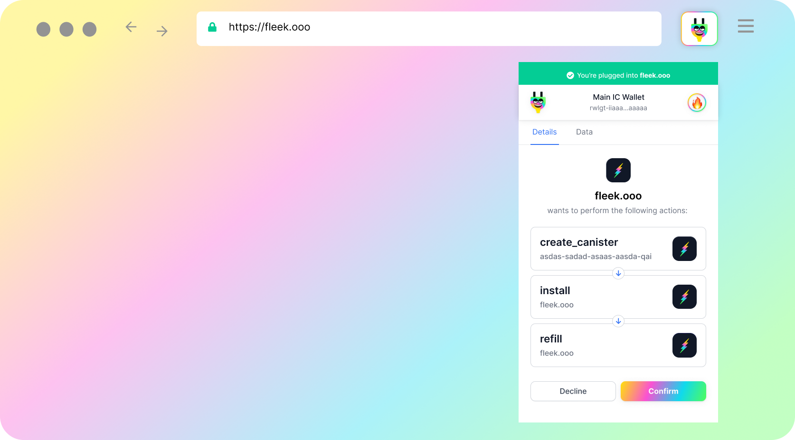

## Request Balance & Trigger Transactions

### requestBalance()

requestBalance() is an [asynchronous](https://developer.mozilla.org/en-US/docs/Learn/JavaScript/Asynchronous) method to request the user's ICP wallet balance, which is consulted in the [Internet Computer's Ledger Canister](https://sdk.dfinity.org/docs/integration/ledger-quick-start.html#_ledger_canister_overview) for ICP, returning the amount of ICP the user's wallet in Plug holds.

The response data is an array with the balances of all assets in the currently connected wallet, and throws an error if the user is not connected:

```js
Array [{
  amount: number,
  currency: string,
  image: string,
  name: string,
  value: number,
}]
```

As an example, copy and paste the following code snippet into the console and execute it.

```js
(async () => {
  const result = await window.ic.plug.requestBalance();
  console.log(result);
})();
```

### requestTransfer(RequestTransferParams)

requestTransfer() is an [asynchronous](https://developer.mozilla.org/en-US/docs/Learn/JavaScript/Asynchronous) method to request a new transfer processed in the Internet Computer [Ledger Canister](https://sdk.dfinity.org/docs/integration/ledger-quick-start.html#_ledger_canister_overview), which takes the parameter `RequestTransferParams` that is an object of fields:

RequestTransferParams:

- to
- amount (an e8s value)
- opts (SendOpts)

SendOpts (optional):

- fee
- memo
- from_subaccount
- created_at_time (TimeStamp)

TimeStamp (optional):

- timestamp_nanos

As in:

```js
Object {
  to: String,
  amount: number,
  opts?: {
    fee?: number,
    memo?: string,
    from_subaccount?: Number,
    created_at_time?: {
      timestamp_nanos: number
    },
  },
}
```

As an example, copy and paste the following code snippet into the console and execute it (replacing the `xxxx-xxxx-xxxx-xxxx` with a valid `Principal ID`):

```js
(async () => {
  const params = {
    to: 'xxxxx-xxxxx-xxxxx-xxxxx',
    amount: 2_000_000,
    memo: '123451231231',
  };
  const result = await window.ic.plug.requestTransfer(params);
  console.log(result);
})();
```

The response data structure, otherwise throws an error:

```js
Object {
  height: Number
}
```

It's a good practice to check the original [source-code](https://github.com/Psychedelic/plug-controller/tree/main/src/utils/dfx) to see the latest type definitions.

### requestBurnXTC - Request Cycles Token (XTC) Burn to Transfer Raw Cycles

You can also use the following method to request a transfer of Cycles Token (XTC) from the user's balance, calling the XTC token canister burn method that "unwraps" the XTC into raw cycles, allowing their transfer to Canisters to refill and power their computation.

```js
type Cycles = number;
type CanisterId = string;
window.ic.plug.requestBurnXTC({ amount: Cycles, to: CanisterId })
```

Here is an example of an asynchronous call made with this method, **"to:" receives a Canister ID.** The **amount is not in decimals**, and is written in the regular trillion cycles format (if you want to send 2 trillion cycles, that is 2 XTC, but you would input: 2000000000000).

```js
(async () => {
  const params = {
    to: 'xxxxx-xxxxx-xxxxx-xxxxx',
    amount: 2_000_000,
  };
  const result = await window.ic.plug.requestBurnXTC(params);
  console.log(result);
})();
```

---

### batchTransactions() - Making Batch Transactions

Developers can allow users to accept multiple canister update call pop-ups in one pop-up modal, instead of one-by-one. This creates a better user experience and looks similar to the image below.



This is done using the **batchTransactions method in the IC Provider API**.

Users will be able to quickly view what actions are being taken by the app on their behalf, or look more closely at each transaction by visiting the “Data” tab where they will be able to see the data of each transaction similarly to the image below.

To create the transactions above, we’ve written a code example below showing how users will be able to implement this in their own applications.

> It's **important to note two things** you can't yet make batch transactions that depend on each other. That feature will come in the future. **And if any transaction fails in the chain, the chain stops** so you need to consider creating fallback options for this.

```js
import { Principal } from '@dfinity/principal';
import React from 'react';
import RandomBigInt from 'random-bigint';
import { getAccountId, getTokenIdentifier } from '../utils';
import CoinflipIDL from '../idls/coinflip.did';
import XtcIDL from '../idls/xtc.did';
import ExtIDL from '../idls/ext.did';
import nns_ledgerDid from '../idls/nns_ledger.did';

export const XTC_CANISTER_ID = 'aanaa-xaaaa-aaaah-aaeiq-cai';
export const STARVERSE_CID = 'nbg4r-saaaa-aaaah-qap7a-cai';
export const NNS_LEDGER_CID = 'ryjl3-tyaaa-aaaaa-aaaba-cai';
const COINFLIP_CANISTER_ID = '24pmb-qiaaa-aaaah-aannq-cai';

const TRANSFER_XTC_TX = {
  idl: XtcIDL,
  canisterId: XTC_CANISTER_ID,
  methodName: 'transfer',
  args: [{ to: Principal.fromText('e5uhc-kq6ct-dgmct-7x2zg-dnytg-kry5b-3rwpw-uuwqj-andm2-cmvis-nqe'), amount: BigInt(1400000), from: [] }],
  onSuccess: async (res) => {
    console.log('transferred xtc successfully');
  },
  onFail: (res) => {
    console.log('transfer xtc error', res);
  },
};

const TRANSFER_STARVERSE_TX = {
  idl: ExtIDL,
  canisterId: STARVERSE_CID,
  methodName: 'transfer',
  args: [{
    to: { principal: Principal.from('e5uhc-kq6ct-dgmct-7x2zg-dnytg-kry5b-3rwpw-uuwqj-andm2-cmvis-nqe') },
    from: { principal: Principal.from('53foq-re32g-vcvl5-e4ptn-y5ndj-coy4v-rgtnh-x65mc-2qfiw-kb2js-7qe') },
    token: getTokenIdentifier(STARVERSE_CID, 420),
    amount: BigInt(1),
    memo: new Array(32).fill(0),
    notify: false,
    subaccount: [],
  }],
  onSuccess: async (res) => {
    console.log('transferred starverse successfully');
  },
  onFail: (res) => {
    console.log('transfer starverse error', res);
  },
};

const TRANSFER_ICP_TX = {
  idl: nns_ledgerDid,
  canisterId: NNS_LEDGER_CID,
  methodName: 'send_dfx',
  args: [{
    to: getAccountId(Principal.from('e5uhc-kq6ct-dgmct-7x2zg-dnytg-kry5b-3rwpw-uuwqj-andm2-cmvis-nqe')),
    fee: { e8s: BigInt(10000) },
    amount: { e8s: BigInt(1000000) },
    memo: RandomBigInt(32),
    from_subaccount: [], // For now, using default subaccount to handle ICP
    created_at_time: [],
  }],
  onSuccess: async (res) => {
    console.log('transferred icp successfully');
  },
  onFail: (res) => {
    console.log('transfer icp error', res);
  },
};


const BatchTransactionsExample = () => {
  const randomTransfers = async () => {
    console.log('Doing a bunch of transfers');
    await window.ic.plug.batchTransactions([TRANSFER_XTC_TX, TRANSFER_ICP_TX, TRANSFER_STARVERSE_TX, FLIP_TRANSACTION(1)])
    console.log('Done!');
  }
  return (
    <div className="batch-transactions-container">
      <h2>Batch Transactions Example</h2>
      <button type="button" onClick={randomTransfers}>Random Transactions</button>
    </div>
  )
}
export default BatchTransactionsExample;
```

## Conclusion

We're currently working hard to bring more features and plan to release them as soon as they become ready. The project is open-source and you are very welcome to participate or follow the progress!

We encourage you to review Plug's code, submit proposals, or submit issues for the team to review.

- [Plug Extension](https://github.com/Psychedelic/plug)
- [Plug Controller](https://github.com/Psychedelic/plug-controller)
- [Plug Inpage Provider](https://github.com/Psychedelic/plug-inpage-provider)

Visit our community and jam with the team in our to expand on any doubts or questions you may have [Discord](https://discord.gg/yVEcEzmrgm)

Hope you enjoyed the read so far and got a basic understanding of how to integrate Plug to your site/app or interact with it.
