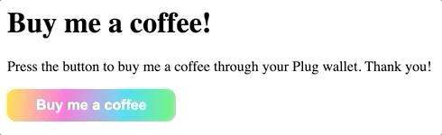
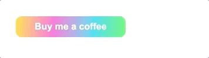

# Building an App that Integrates Plug - Example


We're going to build a very simple application called "Buy me a coffee". It'll have a button that when pressed, request the connection to the Plug wallet and a transfer!

## Requirements

The guide assumes you have some basic knowledge of HTML, CSS and Javascript, we'll keep it easy!

It's recommended to read the [Getting started](/getting-started) guide before you dive into the examples, as it gives you an overview of how Plug works.

Make sure you use a code editor, such as [Visual Studio Code](https://code.visualstudio.com/) or [Sublime text](https://www.sublimetext.com/), for editing the source-code!

## Scaffolding

Just like a real scaffolding in a building construction site, let's create a quick structure for our project - the skeleton for our application!

We're going to write a simple [HTML](https://developer.mozilla.org/en-US/docs/Learn/Getting_started_with_the_web/HTML_basics) structure for a page, where we'll show the "Buy me a coffee" button.

Start by creating a project directory in your operating system, for example, a directory called `Plug-buy-me-coffee` in your `home` path. For MacOS users that'd be `/Users/your-username`, while Windows `c:\Users\your-username`.

In the project directory, create a new file named `index.html`, with the following content and save it! 

```html
<html>
  <head>
    <title>Buy me a coffee</title>
    <!-- App stylesheet (decoration, styles) -->
    <!-- App javascript (functionality, logic) -->
  </head>
  <body>
    <!-- App container (button) -->
  </body>
</html>
```

We'll substitute the comments by the actual implementation, starting by higher-level order:

  - [Application structure](#application-structure)
  - [Custom styles](#custom-styles)
  - Functionality with Javascript, the [Call-to-action](#call-to-action)
  - [Plug implementation](#plug-implementation)

With that said, let's get our hands dirty and start coding!


## Application structure

Open and edit the file `index.html` replacing the `<!-- App container (button) -->` comment with our desired application structure, that should have a button, as follows:

```html
<html>
  <head>
    <title>Buy me a coffee</title>
    <!-- App stylesheet (decoration, styles) -->
    <!-- App javascript (functionality, logic) -->
  </head>
  <body>
    <div id="app">
      <button id="buy-me-coffee">Buy me a coffee</button>
    </div>
  </body>
</html>
```

As you edit the files, feel free to open the `index.html` file in the browser or refresh the page as you go to see the changes!

## Custom styles

Create a new file named `main.css` in the project directory. You'll use this file to place the content to create custom styles for the application: title colour, button size, etc.

Open and edit the file `index.html` replacing the `<!-- App stylesheet (decoration, styles) -->` comment with a link to our external stylesheet file we've just created, as follows:

```html
<html>
  <head>
    <title>Buy me a coffee</title>
    <link rel="stylesheet" href="main.css">
    <!-- App javascript (functionality, logic) -->
  </head>
  <body>
    <div id="app">
      <button id="buy-me-coffee">Buy me a coffee</button>
    </div>
  </body>
</html>
```

Open end edit the stylesheet file `main.css` and add some custom styles, let's say that we make the button super colourful like Plug, for example! Copy the following content to the `main.css`, save it and refresh the page!

```
#buy-me-coffee {
  border: none;
  font-style: normal;
  font-weight: bold;
  font-size: 16px;
  line-height: 24px;
  background: linear-gradient(94.95deg, #FFE701 -1.41%, #FA51D3 34.12%,
  #10D9ED 70.19%, #52FF53 101.95%);
  border-radius: 10px;
  color: #fff;
  padding: 6px 32px;
  cursor: pointer;
  transition: opacity 0.3s ease-in, transform 0.3s ease-in-out;
  transform: scale(1);
}

#buy-me-coffee:hover {
  opacity: 0.94;
  transform: scale(1.02);
}
```

Once you refresh the page, it should look like example below, a colourful [call-to-action](#call-to-action). We'll implement the action next!

{: style="max-width:480px"}

Feel free to edit `main.css` and change the styles to your liking!

## Call-to-action

We are now going to create our main javascript file where our `call-to-action` is implement.

Create a file named `app.js` in the project directory. This is where we'll put our implementation code to handle the request via the [Plug's](/getting-started) application programming interface ([API](https://en.wikipedia.org/wiki/API)), as described in the [Getting started guide](/getting-started).

As an initial placeholder, let's add a "mouse-click" event listener to the `call-to-action` that'll show an alert!

```js
// Initialises the application listeners and handlers
function main() {
  const button = document.querySelector('#buy-me-coffee');
  button.addEventListener("click", onButtonPress);
}

// Button press handler
function onButtonPress() {
  alert("Buy me a coffee button was pressed!")
}

// Calls the Main function when the document is ready
document.addEventListener("DOMContentLoaded", main);
```

We have a main listener that waits for the document to be ready, executed the "main" function; Then adds a listener to our `#buy-me-coffee` button, that when "clicked" executes the "onButtonPress" function.

Open and edit the file `index.html`, replacing the `<!-- App javascript (functionality, logic) -->` with a link to our javascript file `app.js`, as follows:

```html
<html>
  <head>
    <title>Buy me a coffee</title>
    <link rel="stylesheet" href="main.css">
    <script type="text/javascript" src="app.js"></script>
  </head>
  <body>
    <div id="app">
      <button id="buy-me-coffee">Buy me a coffee</button>
    </div>
  </body>
</html>
```

After you save the changes, refresh the page and press the `Buy me a coffee` button. You'll get an alert with the message `Buy me a coffee button was pressed!`.

We're going to implement the Plug process in the function `onButtonPress`.

## Plug implementation

Open the file `app.js` in your code editor and let's work in the `onButtonPress` function.

Our plan is very simple, request a transfer through Plug's of a certain amount, for a Coffee. We can break it down in the following steps:

- [Detect the Plug extension](#detect-the-plug-extension)
- [Check if there's enough balance](#check-if-theres-enough-balance)
- [Request to transfer the amount](#request-to-transfer-the-amount)
- On success, displays the success message
- On error, displays the error message

## Detect the Plug extension

Firstly, we check if the end-user has the Plug extension in the current browser, as documented in the [Getting started guide](/getting-started). Also, noticed that we make the function [asynchronous](https://developer.mozilla.org/en-US/docs/Web/JavaScript/Reference/Statements/async_function).

```js
async function onButtonPress() {
  const hasAllowed = await window.ic.plug.requestConnect();

  if (hasAllowed) {
    console.log('Plug wallet is connected');
  } else {
    console.log('Plug wallet connection was refused')
  }
}
```

From this point, if you'd like to test the changes in the browser you won't be able to interact with the Browser extension because of browser security reasons. As such, you'll need to serve the project through a Web Server!

There are plenty of options and you are free to pick one! The quickest you can get a Web Server running, in your local machine, if you have no clue, is to first install Nodejs. You can find the instructions for your operating system [here](https://nodejs.org/en/download/).

Once [Nodejs](https://nodejs.org/en/download/) is installed and available in your system, you can install the [Http-server](https://www.npmjs.com/package/http-server) package, that is simple to use! Open your terminal and execute the following:

```sh
npm install --global http-server
```

Once the [Http-server](https://www.npmjs.com/package/http-server) package is installed, `cd` to the project directory in your terminal and execute:

```sh
http-server .
```

It'll serve the project in the following addresses, that you can open in the browser that has the Plug extension:

```sh
Starting up http-server, serving .
Available on:
  http://127.0.0.1:8080
  http://xxx.xxx.x.xx:8080
```

Open the `developer console` in the browser to see the script output, (here's an example for [Chrome](https://developer.chrome.com/docs/devtools/open/) and [Firefox](https://developer.mozilla.org/en-US/docs/Tools/Browser_Console)).

Press the `Buy me a Coffee` button, the `Plug` notification window will pop-up. Choose one of the options and find the correspondent output in the console: `Plug wallet is connected` or `Plug wallet connection was refused`.

To complete, ensure that the button is disabled for the duration the Plug wallet request process lasts.

Modify the `onButtonPress` to take a parameter `el`, that passes the DOM button element as an argument during runtime, which we then reset the `disabled` button property after 5 seconds - this because we want to give enough time to the end-user to read the text.

```js
async function onButtonPress(el) {
  el.target.disabled = true;

  const hasAllowed = await window.ic.plug.requestConnect();

  if (hasAllowed) {
    console.log('Plug wallet is connected');
  } else {
    console.log('Plug wallet connection was refused')
  }

  setTimeout(function () {
    el.target.disabled = false;
  }, 5000);
}
```

## Check if there's enough balance

To keep things easy, let's say that a Coffee is the equivalent of `0.1` (fractional units of ICP tokens, called [e8s](https://sdk.dfinity.org/docs/token-holders/self-custody-quickstart.html)).

Add the amount at the top of the `app.js` file!

```js
const coffeeAmount = 0.1;
```

Finally, we check if the user has enough balance before proceeding to the last step and request the transfer.

We also change the button text in each state change.

{: style="max-width:480px"}

```js
async function onButtonPress() {
  el.target.disabled = true;

  const hasAllowed = await window.ic?.plug?.requestConnect();

  if (hasAllowed) {
    el.target.textContent = "Plug wallet is connected";

    const balance = await window.ic?.plug?.requestBalance();

    if (balance >= coffeeAmount) {
      el.target.textContent = "Plug wallet has enough balance";
    } else {
      el.target.textContent = "Plug wallet doesn't have enough balance";
    }
  } else {
    el.target.textContent = "Plug wallet connection was refused";
  }

  setTimeout(function () {
    el.target.disabled = false;
  }, 5000);
}
```

After saving the file, refresh the page and press the `Buy me a Coffee` button. You should see the correspondent message to your account balance: `Plug wallet has enough balance` or `Plug wallet doesn't have enough balance`.

## Request to transfer the amount

In the "has enough balance" block, make the `requestTransfer` call, that requires us to pass an argument to the function, that is an object with required fields `accountId` and `amount`, as described in our [Getting started](/getting-started).

```js
const requestTransferArg = {
  accountId: 'xxxxx',
  amount: coffeeAmount,
};

const transfer = await window.ic?.plug?.requestTransfer(requestTransferArg);
```

When the `requestTransfer` is called, the `Plug` pop-up will show the panel:

{: style="max-width:360px"}

As we go, the button text is updated according to the transfer result state and when finished, we reset the Button to have the original text `Buy me a coffee`.

```js
async function onButtonPress(el) {
  el.target.disabled = true;

  const hasAllowed = await window.ic?.plug?.requestConnect();

  if (hasAllowed) {
    el.target.textContent = "Plug wallet is connected"

    const balance = await window.ic?.plug?.requestBalance();

    if (balance >= coffeeAmount) {
      el.target.textContent = "Plug wallet has enough balance"

      const requestTransferArg = {
        accountId: 'xxxxx',
        amount: coffeeAmount,
      };
      const transfer = await window.ic?.plug?.requestTransfer(requestTransferArg);

      if (transfer) {
        el.target.textContent = `Plug wallet transferred ${coffeeAmount}`;
      } else {
        el.target.textContent = "Plug wallet failed to transfer";
      }
    } else {
      el.target.textContent = "Plug wallet doesn't have enough balance";
    }
  } else {
    el.target.textContent = "Plug wallet connection was refused";
  }

  setTimeout(() => {
    el.target.disabled = false;
    el.target.textContent = "Buy me a coffee"
  }, 5000);
}
```

Save the changes, refresh the browser and play with it! If everything's done correctly you should have a working application, that connects to Plug and makes a transfer.

Hope you enjoyed the read this far and got to build a very simple application with Plug!

## Project source-code

The source-code for this guide can be found in our [examples](https://github.com/Psychedelic/plug-docs/tree/main/examples/buy-me-a-coffee).

