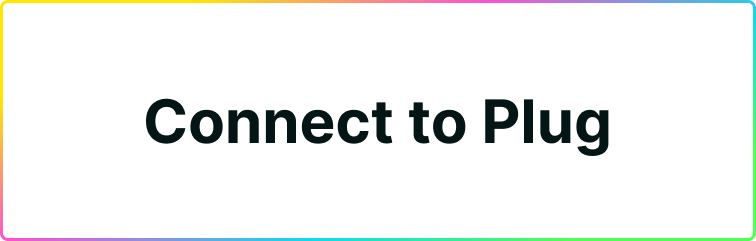

# Connect your App to Plug



## 🔌 Connect your App to Plug
Start interacting with the user's wallet by requesting a connect, and if needed, passing the necessary information to interact with the Agent and Actor.


### requestConnect(RequestConnectParams?)

requestConnect() is an [asynchronous](https://developer.mozilla.org/en-US/docs/Learn/JavaScript/Asynchronous) method to request a new connection by showing a pop-up to the Plug user, that resolves to Boolean: `true` or `false` based on the users response.

As an example, copy and paste the following code snippet into the console and execute it.

Select `Allow` or `Decline` in the pop-up and to see the corresponding result (Allowed or Declined) in the console.

If accepted, the `requestConnect` method returns an object containing the publicKey of the connected account.
If declined, the method will throw an error.

```js
(async () => {
  try {
    const publicKey = await window.ic.plug.requestConnect();
    console.log(`The connected user's public key is:`, publicKey);
  } catch (e) {
    console.log(e);
  }
})();
```

Optionally, you can pass the following parameters to **integrate Plug's Agent** features, for authenticating a user's identity and requesting access to the Plug Agent to sign requests to your canisters on behalf of that identity.

The fields are:

  - whitelist - an Array of Canister Ids of type string
  - host - a string representing a network URL that when not set defaults to the `mainnet.dfinity.network`
  - timeout - parameter that can be added to requestConnect and set as a global variable for the rest of the modals on your dapp. For example, if you set it to 5000, the modal will close in 5000 milliseconds or 5 seconds if the user fails to choose an action. By default, this is set to 2 minutes. 

!!! Important
    
    Passing a whitelist is telling Plug to pass the user a list of canisters that your app will be able to interact with through the PlugAgent, on their behalf. NOTE: You should only be interacting with whitelisted canisters through an actor created through createActor( ). More on that soon.

This is how it looks:

```js
Object {
  whitelist?: ['canister-id'],
  host?: 'https://network-address',
  timeout: 50000
}
```

Here's an hypothetical example:

```js
(async () => {
  // Canister Ids
  const nnsCanisterId = 'qoctq-giaaa-aaaaa-aaaea-cai'

  // Whitelist
  const whitelist = [
    nnsCanisterId,
  ];

  // Host
  const host = "https://mainnet.dfinity.network";

  // Make the request
  try {
    const publicKey = await window.ic.plug.requestConnect({
      whitelist,
      host,
      timeout: 50000
    });
    console.log(`The connected user's public key is:`, publicKey);
  } catch (e) {
    console.log(e);
  }
})();
```

You can learn more about this and use a template button implementation by reading our [Plug button](/getting-started/plug-button) guide! A ready-to-go "Connect to Plug" button for your app.

### isConnected()

isConnected() is an [asynchronous](https://developer.mozilla.org/en-US/docs/Learn/JavaScript/Asynchronous) method to check the connection status, that returns a Boolean: `true` or `false`.

```js
(async () => {
  const result = await window.ic.plug.isConnected();
  console.log(`Plug connection is ${result}`);
})()
```

## ⚡ Persisting an App/Plug Connection

After initiating a connection to Plug with a whitelist, you can add this check as a fallback to ensure the connect persists as the user navigates your application/website

This checks the status of the connection to the user’s wallet in Plug; if at any moment it turns into false, it will re-requests it. 

```js
const connected = await window.ic.plug.isConnected();
if (!connected) await window.ic.plug.requestConnect({ whitelist, host });
```

You can use this, for example, in a useEffect inside of your apps main component (index/app) to do a check after load. You can pass on the same whitelist as before (won’t require re-approval by the user, unless access was revoked), or a different whitelist Canister ID set (will require the user’s approval).

```js
const verifyConnection = async () => {
  const connected = await window.ic.plug.isConnected();
  if (!connected) await window.ic.plug.requestConnect({ whitelist, host });
};

useEffect(async () => {
  verifyConnection();
}, []);
```