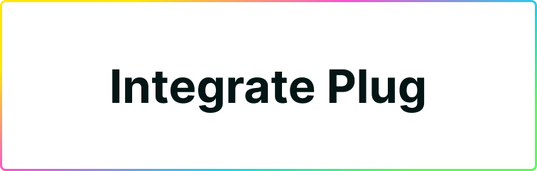

# Integrate Plug



## Browser extension

Interacting with the [Plug](https://plugwallet.ooo/) browser extension is made simple by the IC Provider API, an API that Plug injects into websites to allow them to call Plug and interact with the extension.

Get started by adding the extension in the browser, or if you already done so make sure that is enabled in the "extensions" or "Add-ons" menu of your browser!

Pin the Plug extension to the browser bar for easy access (here's an example of how to do it in [Chrome](https://support.google.com/chrome_webstore/answer/2664769?hl=en-GB)).

Once the [Plug](https://plugwallet.ooo/) extension is installed, a `Plug` object is available as a property of `window.ic` in the browser window or tabs. Your application will be able to detect the extension by checking the `window` object and if available, interact with it!

## Console playground

Once you have the Plug extension, run a quick test to detect it by opening the browser developer console (here's an example for [Chrome](https://developer.chrome.com/docs/devtools/open/) and [Firefox](https://developer.mozilla.org/en-US/docs/Tools/Browser_Console)). Note that if you just installed Plug you need to **refresh the page (F5 on Windows)** so that Plug is detected correctly.

Copy and paste the following code snippet into the console and execute it by pressing the `ENTER` key of your keyboard.

```js
window.ic.plug && "Plug and play!"
```

The result output should be `Plug and play!`, if you have Plug installed correctly!

If you get an `error`, you're advised to check the installation instructions for [Plug](https://plugwallet.ooo/) and ensure that you have the extension installed correctly!

## Plug window object

Plug provides a simple API to websites and webapps at `window.ic.plug`, enabling them to "talk to" the Internet computer via Plug.

As we continue to develop features and make them available, the API will let you:

- Detect the Plug extension
- Interact and authenticate an account
- Query data from the Internet Computer
- Trigger a transaction for the end-user approval

As previously noted, we can interact directly with the API through our browser developer console.

Copy and paste the following code snippet into the console and execute it:

```js
window.ic.plug.requestConnect()
```

!!! Important

    Because of browser security restrictions, access to the Plug extension API is only allowed from pages accessed via HTTP/HTTPS. For example, you'd be allowed to interact with it from the current [documentation URL](https://docs.plugwallet.ooo/getting-started/connect-to-plug/), but not the default options page `chrome-extension://xxxx/options.html`.

A `Plug notification` window will pop-up, displaying the options to `Allow` or `Decline` the connection to the user wallet:

{: style="max-width:360px"}

After you `Allow` or `Decline`, the notification popup will close!

To understand how to read the response data for the `requestConnect` call and any other [asynchronous](https://developer.mozilla.org/en-US/docs/Learn/JavaScript/Asynchronous) method, read below.


----


## Available interactions and methods

## 🔌 Connect your App to Plug
Start interacting with the user's wallet by requesting a connect, and if needed, passing the necessary information to interact with the Agent and Actor.


### requestConnect(RequestConnectParams?)

requestConnect() is an [asynchronous](https://developer.mozilla.org/en-US/docs/Learn/JavaScript/Asynchronous) method to request a new connection by showing a pop-up to the Plug user, that resolves to Boolean: `true` or `false` based on the users response.

As an example, copy and paste the following code snippet into the console and execute it.

Select `Allow` or `Decline` in the pop-up and to see the corresponding result (Allowed or Declined) in the console.

```js
(async () => {
  const result = await window.ic.plug.requestConnect();
  const connectionState = result ? "allowed" : "denied";
  console.log(`The Connection was ${connectionState}!`);
})();
```

Optionally, you can pass the following parameters to **integrate Plug's Agent** features, for authenticating a user's identity and requesting access to the Plug Agent to sign requests to your canisters on behalf of that identity.

The fields are:

  - whitelist - an Array of Canister Ids of type string
  - host - a string representing a network URL that when not set defaults to the `mainnet.dfinity.network`

!!! Important
    
    Passing a whitelist is telling Plug to pass the user a list of canisters that your app will be able to interact with through the PlugAgent, on their behalf. NOTE: You should only be interacting with whitelisted canisters through an actor created through createActor( ). More on that soon.

This is how it looks:

```js
Object {
  whitelist?: ['canister-id'],
  host?: 'https://network-address',
}
```

Here's an hypothetical example:

```js
(async () => {
  // Canister Ids
  const nnsCanisterId = 'qoctq-giaaa-aaaaa-aaaea-cai'

  // Whitelist
  const whitelist = [
    nnsCanisterId,
  ];

  // Host
  const host = "https://mainnet.dfinity.network";

  // Make the request
  const result = await window.ic.plug.requestConnect({
    whitelist,
    host,
  });

  const connectionState = result ? "allowed" : "denied";
  console.log(`The Connection was ${connectionState}!`);
})();
```

You can learn more about this and use a template button implementation by reading our [Plug button](/getting-started/plug-button) guide! A ready-to-go "Connect to Plug" button for your app.

### isConnected()

isConnected() is an [asynchronous](https://developer.mozilla.org/en-US/docs/Learn/JavaScript/Asynchronous) method to check the connection status, that returns a Boolean: `true` or `false`.

```js
(async () => {
  const result = await window.ic.plug.isConnected();
  console.log(`Plug connection is ${result}`);
})()
```

## ⚡ Persisting an App/Plug Connection

After initiating a connection to Plug with a whitelist, you can add this check as a fallback to ensure the connect persists as the user navigates your application/website

This checks the status of the connection to the user’s wallet in Plug; if at any moment it turns into false, it will re-requests it. 

```js
const connected = await window.ic.plug.isConnected();
if (!connected) await window.ic.plug.requestConnect({ whitelist, host });
```

You can use this, for example, in a useEffect inside of your apps main component (index/app) to do a check after load. You can pass on the same whitelist as before (won’t require re-approval by the user, unless access was revoked), or a different whitelist Canister ID set (will require the user’s approval).

```js
const verifyConnection = async () => {
  const connected = await window.ic.plug.isConnected();
  if (!connected) await window.ic.plug.requestConnect({ whitelist, host });
};

useEffect(async () => {
  verifyConnection();
}, []);
```

## 📡 Making Calls to Canisters with Plug

Once connected, you can use Plug to make proxied calls to a canister on behalf of your users. This is the main way **your app will be able to call actions on behalf of users**, like calling an update method on your app's BE canister to make a post (if it is a social media), or interact with an NFT collection's canister, etc.

1. First, connect to Plug and pass a whitelist of canisters you need to interact to.
2. The user will approve the connection, giving you access to the createActor method.
3. Use the createActor method to make safe calls to canisters on behalf of users.

!!! Important
    
    It is key to use the createActor to talk to a canister on behalf of users. Using the agent on its own, and creating an Actor on your end (without using Plug's method) will show users a warning when they need to approve update calls that affect their assets. This is considered an unsafe practice because it isn't fully transparent to users on the parameters you pass.

### createActor() - Making Safe Calls

createActor() is an [asynchronous](https://developer.mozilla.org/en-US/docs/Learn/JavaScript/Asynchronous) method that creates an Actor to interact with the [Internet Computer](https://dfinity.org/). Returns an Actor for the provided Canister Id and interface factory ([Candid](https://sdk.dfinity.org/docs/candid-guide/candid-concepts.html) or [IDL](https://sdk.dfinity.org/docs/candid-guide/candid-concepts.html#_why_create_a_new_idl)).

The `createActor` expects that the Agent is initialized beforehand by calling the `requestConnect` method with the whitelist (canister ID string array) and the host (string).

As mentioned above, on instantiation the `Agent` is assigned to the window Plug object, as `window.ic.plug.agent`. Creating an Actor allows you to securely interact with a canister’s interface on behalf of the user. 

```js
(async () => {
  // NNS Canister Id as an example
  const nnsCanisterId = 'qoctq-giaaa-aaaaa-aaaea-cai'
  const whitelist = [nnsCanisterId];

  // Initialise Agent, expects no return value
  await window?.ic?.plug?.requestConnect({
    whitelist,
  });

  // A partial Interface factory
  // for the NNS Canister UI
  // Check the `plug authentication - nns` for more
  const nnsPartialInterfaceFactory = ({ IDL }) => {
    const BlockHeight = IDL.Nat64;
    const Stats = IDL.Record({
      'latest_transaction_block_height' : BlockHeight,
      'seconds_since_last_ledger_sync' : IDL.Nat64,
      'sub_accounts_count' : IDL.Nat64,
      'hardware_wallet_accounts_count' : IDL.Nat64,
      'accounts_count' : IDL.Nat64,
      'earliest_transaction_block_height' : BlockHeight,
      'transactions_count' : IDL.Nat64,
      'block_height_synced_up_to' : IDL.Opt(IDL.Nat64),
      'latest_transaction_timestamp_nanos' : IDL.Nat64,
      'earliest_transaction_timestamp_nanos' : IDL.Nat64,
    });
    return IDL.Service({
      'get_stats' : IDL.Func([], [Stats], ['query']),
    });
  };

  // Create an actor to interact with the NNS Canister
  // we pass the NNS Canister id and the interface factory
  const NNSUiActor = await window.ic.plug.createActor({
    canisterId: nnsCanisterId,
    interfaceFactory: nnsPartialInterfaceFactory,
  });

  // We can use any method described in the Candid (IDL)
  // for example the get_stats()
  // See https://github.com/dfinity/nns-dapp/blob/cd755b8/canisters/nns_ui/nns_ui.did
  const stats = await NNSUiActor.get_stats();
  console.log('NNS stats', stats);
})()
```

### ⚠️ How NOT to Make Canister Calls
Making calls on behalf of the user directly through the Plug Agent is not a suggested way to make calls. **That is why Plug has an exposed createActor method** shown above. 

If you bypass the createActor method and use the Agent to create an actor on your side; when that actor is sent to be signed by Plug it will show the user a warning, because Plug is not able to read all the arguments passed to that call, and considers it risky for the user to accept the action.

To learn more about what happens on both the user and developer side if you try to bypass the createActor( ) flow, [you can read this section of our documentation.](https://docs.plugwallet.ooo/resources/app-trust-and-security/)

### Plug Agent (.agent)

On instantiation (requestConnect with whitelist) the `Agent` is assigned to the window Plug object as:

```js
window.ic.plug.agent
```

The agent field is an instance of the **HttpAgent** class from the [@dfinity/agent](https://github.com/dfinity/agent-js) library, that allow us to interact with the Internet Computer.

!!! Important
    
    It's important to note that we are going to deprecate direct access to the agent in the near future, as developers should be using the CREATE ACTOR method to make calls to canisters through Plug. You can check the correspondent commit version for the latest interface, in accordance to the `dfinity/agent` version in [use](https://github.com/Psychedelic/plug-controller/blob/main/package.json).

Here's an example, of getting the user principal id:

```js
(async () => {
  // Canister Ids
  const nnsCanisterId = 'qoctq-giaaa-aaaaa-aaaea-cai'

  // Whitelist
  const whitelist = [
    nnsCanisterId,
  ];

  // Make the request
  const isConnected = await window.ic.plug.requestConnect({
    whitelist,
  });

  // Get the user principal id
  const principalId = await window.ic.plug.agent.getPrincipal();

  console.log(`Plug's user principal Id is ${principalId}`);
})();
```

----

## Request Balance & Trigger Transactions

### requestBalance()

requestBalance() is an [asynchronous](https://developer.mozilla.org/en-US/docs/Learn/JavaScript/Asynchronous) method to request the user's ICP wallet balance, which is consulted in the [Internet Computer's Ledger Canister](https://sdk.dfinity.org/docs/integration/ledger-quick-start.html#_ledger_canister_overview) for ICP, returning the amount of ICP the user's wallet in Plug holds.

The response data is an array, otherwise throws an error:

```js
Array [{
  amount: number,
  currency: string,
  image: string,
  name: string,
  value: number,
}]
```

As an example, copy and paste the following code snippet into the console and execute it.

```js
(async () => {
  const result = await window.ic.plug.requestBalance();
  console.log(result);
})();
```

### requestTransfer(RequestTransferParams)

requestTransfer() is an [asynchronous](https://developer.mozilla.org/en-US/docs/Learn/JavaScript/Asynchronous) method to request a new transfer processed in the Internet Computer [Ledger Canister](https://sdk.dfinity.org/docs/integration/ledger-quick-start.html#_ledger_canister_overview), which takes the parameter `RequestTransferParams` that is an object of fields:

RequestTransferParams:

- to
- amount (an e8s value)
- opts (SendOpts)

SendOpts (optional):

- fee
- memo
- from_subaccount
- created_at_time (TimeStamp)

TimeStamp (optional):

- timestamp_nanos

As in:

```js
Object {
  to: String,
  amount: number,
  opts?: {
    fee?: number,
    memo?: number,
    from_subaccount?: Number,
    created_at_time?: {
      timestamp_nanos: number
    },
  },
}
```

As an example, copy and paste the following code snippet into the console and execute it (replacing the `xxxx-xxxx-xxxx-xxxx` with a valid `Principal ID`):

```js
(async () => {
  const params = {
    to: 'xxxxx-xxxxx-xxxxx-xxxxx',
    amount: 2_000_000,
  };
  const result = await window.ic.plug.requestTransfer(params);
  console.log(result);
})();
```

The response data structure, otherwise throws an error:

```js
Object {
  height: Number
}
```

It's a good practice to check the original [source-code](https://github.com/Psychedelic/plug-controller/tree/main/src/utils/dfx) to see the latest type definitions.

### requestBurnXTC - Request Cycles Token (XTC) Burn to Transfer Raw Cycles

You can also use the following method to request a transfer of Cycles Token (XTC) from the user's balance, calling the XTC token canister burn method that "unwraps" the XTC into raw cycles, allowing their transfer to Canisters to refill and power their computation.

```js
type Cycles = number;
type CanisterId = string;
window.ic.plug.requestBurnXTC({ amount: Cycles, to: CanisterId })
```

Here is an example of an asynchronous call made with this method, **"to:" receives a Canister ID.** The **amount is not in decimals**, and is written in the regular trillion cycles format (if you want to send 2 trillion cycles, that is 2 XTC, but you would input: 2000000000000).

```js
(async () => {
  const params = {
    to: 'xxxxx-xxxxx-xxxxx-xxxxx',
    amount: 2_000_000,
  };
  const result = await window.ic.plug.requestBurnXTC(params);
  console.log(result);
})();
```


---

## Conclusion

We're currently working hard to bring more features and plan to release them as soon as they become ready. The project is open-source and you are very welcome to participate or follow the progress!

Hope you enjoyed the read so far and got a basic understanding of how to integrate Plug to your site/app or interact with it.