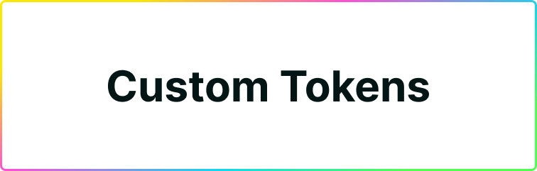
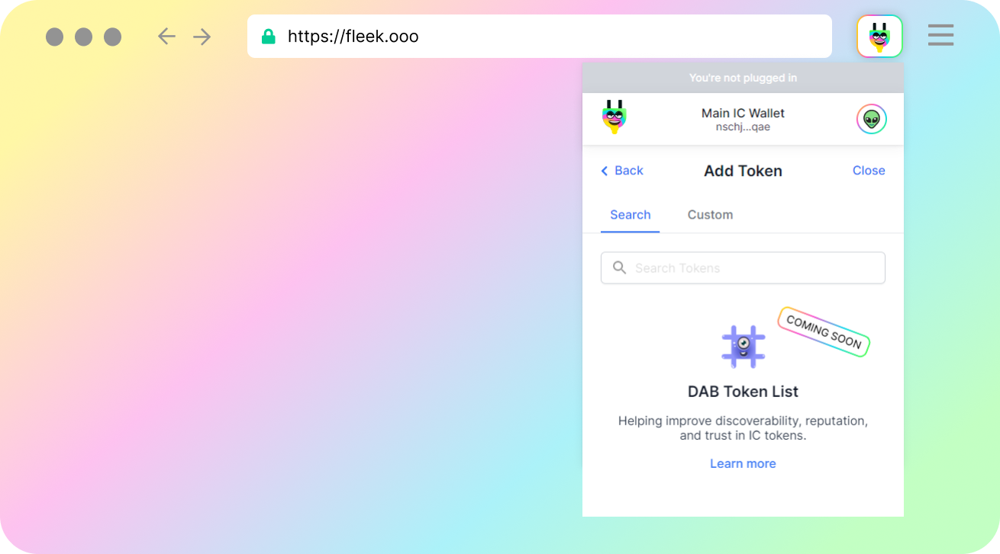
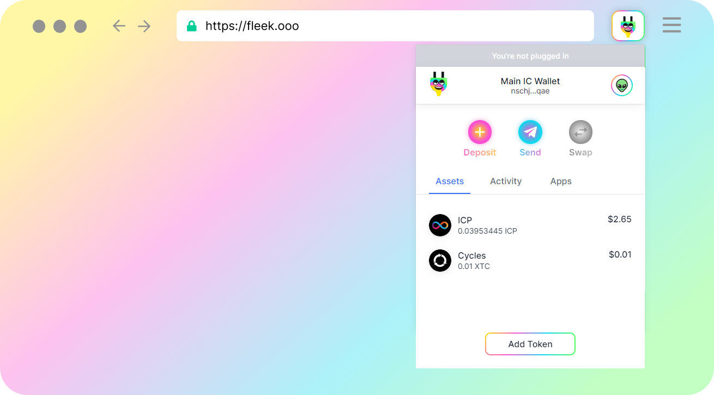
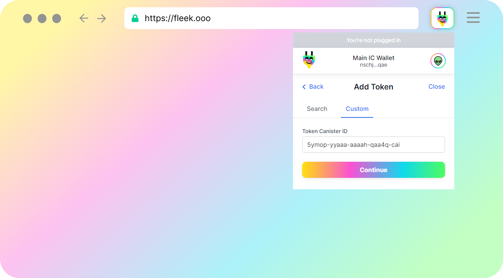
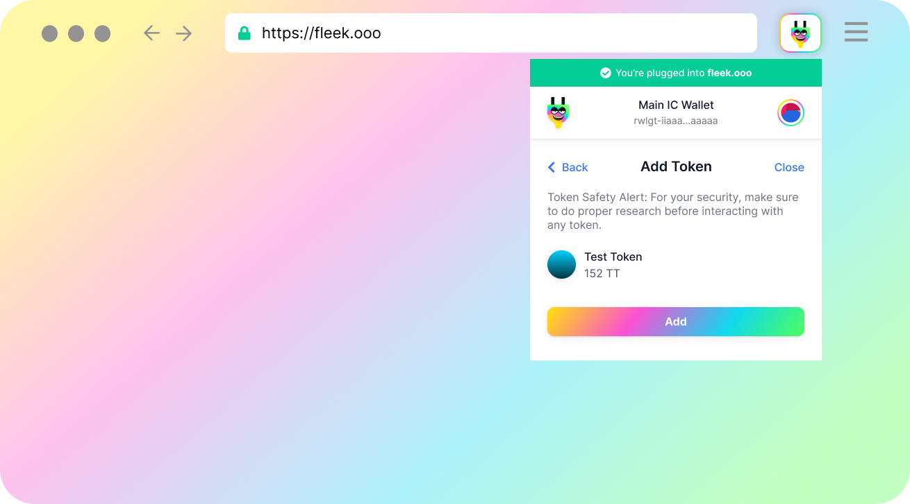

# Custom Tokens in Plug



Plug supports any custom Internet Computer token that follows the Extendable Token Standard. By this, we mean any user can **add a custom token following the [Extendable Token Standard](https://github.com/Toniq-Labs/extendable-token)**.

To add a new custom token to Plug, you will need to **specify the Canister ID for the token’s canister**. Plug will automatically then surface it on the list, and show you the balance associated with your Principal ID in Plug, and you'll be able to send them to others using the SEND flow.

## EXT Token Standard

Plug supports custom token integration using the **Extendable Token Standard interface (EXT)**, all* tokens created with this token standard are compatible with Plug and can be used for sending / receiving / holding in Plug. 

We came to this standard based on feedback from the community, other IC projects, & IC developers on the ecosystem. There was a need for a simple, flexible, multi-purpose Fungible Token Standard, and we -and the community- see that in EXT.

To see the EXT token standard interface, learn how to deploy your own EXT token, and/or suggest proposals please visit the [EXT GitHub repository](https://github.com/Toniq-Labs/extendable-token).

### Important: Single EXT Tokens Only

**Plug does not support sub-tokens** (EXT token canisters with “multiple tokens” inside, referenced with Token IDs). We only support EXT tokens that are 1 canister = 1 token, and referenced with just the token's Canister ID. [Learn more about the why here.](#why-does-plug-not-support-ext-sub-tokens)

## DAB Token List (Coming Soon)


If you go through the "Add Token" flow (see below), you'll see there is a Search tab! This is the **DAB tokens list**, an upcoming feature that will be powered by [DAB](https://dab.ooo).

DAB is an in-development open internet service that will provide interface-agnostic user profiles & data, human-readable Principal ID & Canister ID names & info, as well as canister, token, NFT, and Dapp registries & verification for quality assurance and risk reduction in the ecosystem.

Learn more about it on its [Website](https://dab.ooo) and [GitHub](https://github.com/psychedelic/dab) repository, and make early submissions to the NFT, Token, or Dapp lists.

## How to add a Custom IC Token to Plug
In the Plug interface, go to the main assets/token tab, and click on “Add Tokens”.



Visit the **Custom** tab to manually add a new token using its Canister ID.



In the Custom tab, copy & paste the canister ID, the format looks like this: ```6ceop-cyaaa-aaaah-qaa4q-cai```. The Canister ID should be the one representing the main canister for that token (much like token contract addresses on Ethereum!).


After clicking “Continue”, click “Add” in the modal asking you to confirm if this is the token you want to add.



You’re done! You should now see your token balance in Plug & be able to send/receive from Plug. 

Remember that if your Plug Principal ID doesn't have a balance on that token, you'll see "0". If your funds are on a different Principal ID, you will need to send them to your Principal ID in Plug.

---

## Why does Plug not support EXT sub-tokens?

The EXT standard, aside from the regular token architecture where 1 canister = 1 token, **supports having “sub-tokens” or multiple tokens** inside one “market” or “parent” canister.

These are referenced with **both a Canister ID (parent canister), and a Token ID** to look for it inside the canister (whereas in the single token architecture you only need a Canister ID). **These are the type of tokens you can create, for example, on the Stoic wallet** (sub-tokens inside a "parent" or "registry" canister owned by Stoic).

**There’s a couple reasons why we chose to not go down the route** of supporting canisters with “multiple tokens” or sub-tokens:

**The primary reason for this is because it adds a centralization/risk point** where several user created tokens depend on a single canister. Things like throughput, performance, scalability, control, and takeover/vulnerability risks that might appear would affect all tokens.

**The second reason is that it adds a new unique identifier** (Token IDs) which doesn’t help achieve better composability on the Internet Computer. We need to maintain simple unique identifiers (one ID to find a token, not two), and reduce the number of “walled gardens” or interface-specific markets.

**The final reason is that it blocks you from the main perk of EXT: expandability**. The token standard itself is customizable and expandable, but creating sub-tokens in someone else’s canister doesn’t allow you to develop or grow the EXT standard with custom features specific to your token, if needed, since it blocks and limits you to use the main canisters implementations.

There's also the question of how computation is handled in a shared canister, and how the cost is distributed or taken. It is early, and for these reasons, we only support single custom EXT tokens to minimize risks. Meaning Plug only supports custom tokens following the EXT standard, deployed to the Internet Computer in its own and non-shared token canister (referenced by a Canister ID).