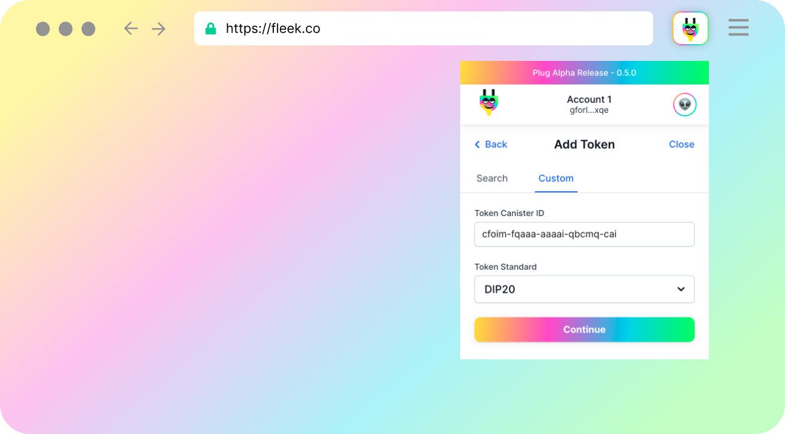
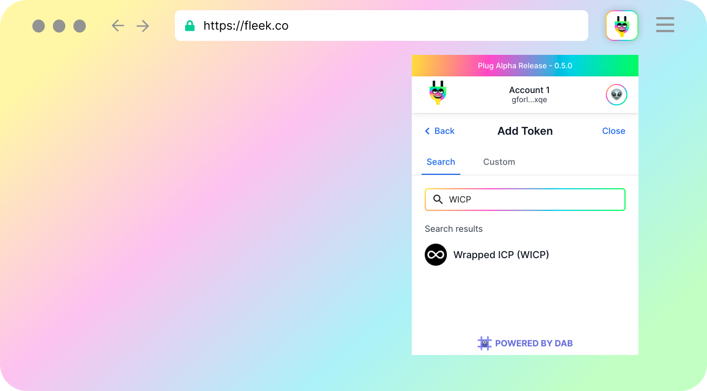

# Tokens in Plug


When you first login to Plug, you'll notice that only a handful of tokens are pre-loaded. In the bottom right corner of your tokens tab, there is a (+) button for adding any non-loaded tokens. **There are two other ways to load-in new tokens to Plug: Search & Custom.**

### (1) Custom - Add Non-Listed Custom Tokens

Plug supports any custom Internet Computer token that follows the Extendable Token Standard or DIP20 Standard. By this, we mean any user can **add custom tokens to Plug that follow the [Extendable Token Standard](https://github.com/Toniq-Labs/extendable-token) or the [DIP20 Standard](https://github.com/Psychedelic/DIP20)**.



To add a new custom token to Plug, you will need to **specify the Canister ID for the token’s canister**. Canister ID's format looks like this: ```6ceop-cyaaa-aaaah-qaa4q-cai```. The Canister ID should be the one representing the main canister for that token (much like token contract addresses on Ethereum). Then select the token standard (EXT or DIP20).

Once you've clicked `Continue` and subsequently `Add`, you'll be brought back to your tokens tab where Plug will automatically surface your newly added custom token, show your Principal ID's balance of that token, and allow you to send the new token to others.

### (2) Search - Add From DAB's Token List

Plug also makes use of [DAB's Token List](https://dab.ooo), a community-driven & standard-agnostic registry that keeps track of Internet Computer tokens.



Adding tokens from the search tab is even easier than adding custom tokens because the Token List already keeps track of token metadata (ie: token standard, token image, token name). Plug simply allow users to search through the already generated list to pick and choose which tokens they'd like to surface.

**Don't see your favorite token when searching?** Tell them to add themselves to DAB's Token List [here](https://dab-ooo.typeform.com/token-list?typeform-source=dab.ooo).

### My Balance Isn't Showing After Adding A New Token?

Remember that if your Plug Principal ID doesn't have a balance on that token, you'll see "0". 

If your funds are on a different Principal ID (could be a sub-account or a different Plug wallet altogther), you will need to send them to your Principal ID in Plug.

If you're sure that isn't the case, please first checkout our [Troubleshooting Guide](../resources/troubleshooting-tokens.md) and if that doesn't work, ask for support in [our Discord](https://discord.gg/yVEcEzmrgm).

---
## Token Standards

Plug supports custom token integration using the **Extendable Token Standard interface (EXT) or DIP20 Standard**, all tokens created with this token standard are compatible with Plug and can be used for sending / receiving / holding in Plug. 

To see the EXT token standard interface, learn how to deploy your own EXT token, and/or suggest proposals please visit the [EXT GitHub repository](https://github.com/Toniq-Labs/extendable-token).

As for the DIP20 token standard interface, learn how to deploy your own DIP20 token, and/or suggest proposals please visit the [DIP20 GitHub repository](https://github.com/Psychedelic/DIP20).

### Important: Single EXT Tokens Only

**Plug does not support sub-tokens** (EXT token canisters with “multiple tokens” inside, referenced with Token IDs). We only support EXT tokens that are 1 canister = 1 token, and referenced with just the token's Canister ID. 