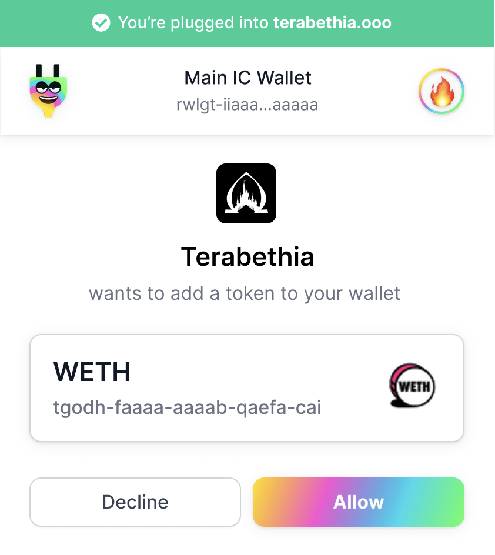

## Request Import Tokens

### requestImportToken(RequestImportTokenParams)

requestImportToken() is an [asynchronous](https://developer.mozilla.org/en-US/docs/Learn/JavaScript/Asynchronous) method to request the user to import a DIP20 or EXT token, which takes the parameter `RequestImportTokenParams` that is an object of fields:

RequestTransferParams:

- canisterId (string)
- standard ('DIP20 | 'EXT')

The response data is a boolean or an Error.

As an example, copy and paste the following code snippet into the console and execute it.

```js
(async () => {
  const result = await window.ic.plug.requestImportToken({
    canisterId: 'tgodh-faaaa-aaaab-qaefa-cai',
    standard: 'DIP20',
  });
  console.log(result);
})();
```

