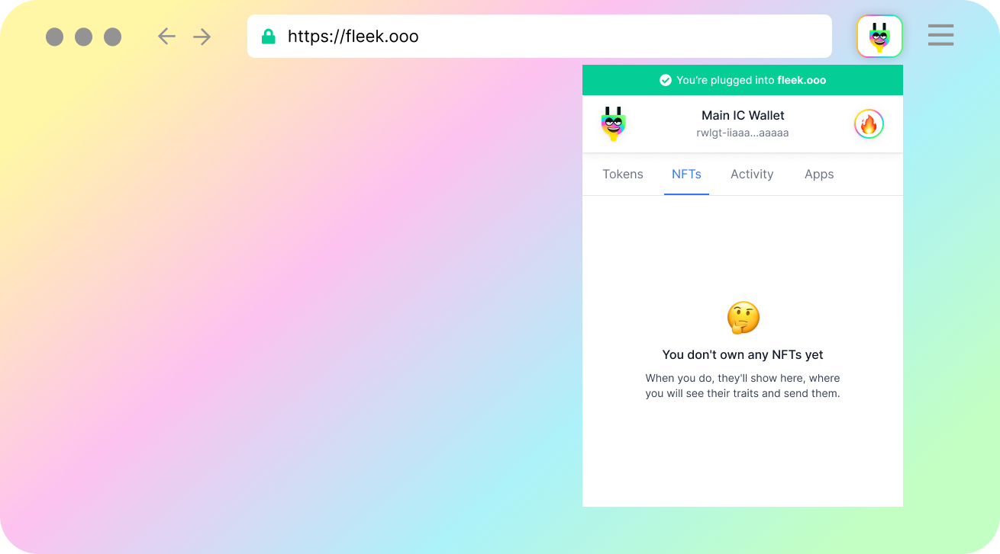
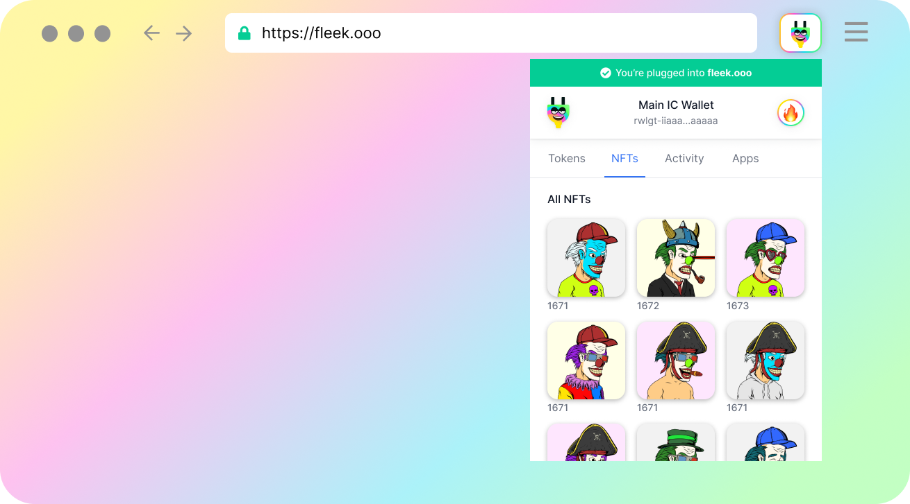
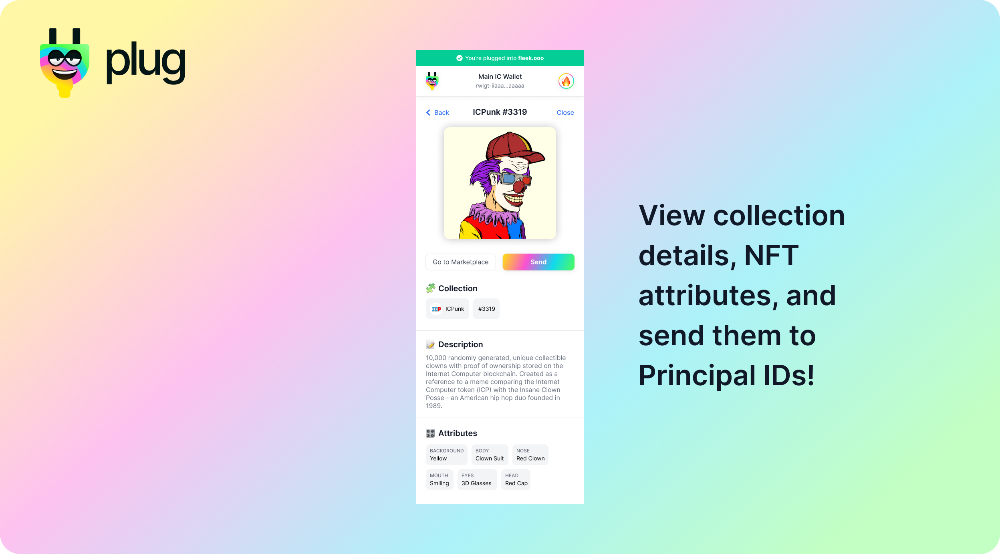
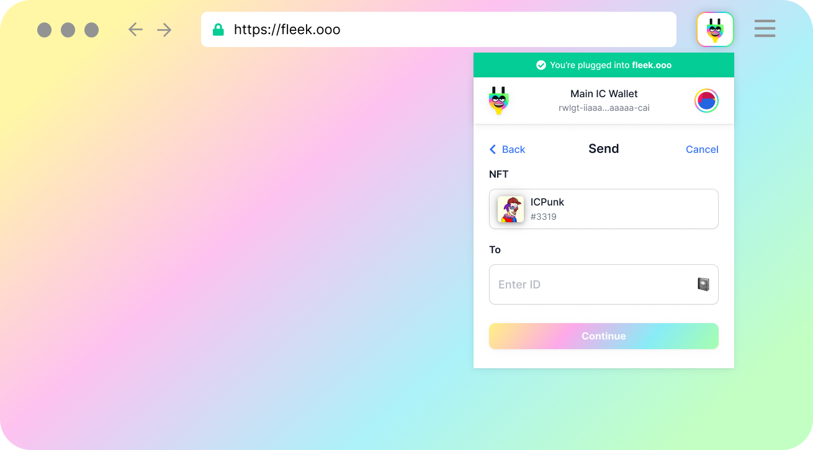

# NFTs in Plug

As of V0.3.1, we've added the **NFTs Tab** in your main assets view! With Plug, you will be able view the NFTs held/owned by your Principal ID (currently only compatible ones), view a specific NFT's details and attributes, and send them through Plug's UI to a different Principal ID.

## DAB's NFT List - (EXT, ICPunks, and more...)

Plug supports several NFT standards and collections using DAB's NFT list  [(Learn More)](https://dab.ooo/). In a nutshell, DAB is a registry or NFT list for NFTs of any standard that any UI/app (like Plug!) can query to fetch, surface, and integrate many NFT collections at once (instead of manually integrating each one!).

We use the DAB JS library to support the standards/NFTs in the list, provided by DAB; as of the release of this integration (V0.3.3) we only auto-surface EXT & ICPunks NFTs, though other collections and standards are available in DAB.

We will soon expand this list and add support for any other DAB-listed NFT/standard. Our goal is not to favor any standard, but have an easy way to automatically support many ones at once (for that, we do need to make some implementations on our next release).

## Viewing NFT Details & Sending an NFT
In the Plug interface, you will now see the new NFTs tab!

If your wallet's Principal ID owns a compatible NFT (like ICPunks) Plug will auto-surface your owned assets in a list.

If you **click on one of your NFTs** you will enter the **details view**, where you can see the NFT's specific attributes, the collection's details, and more information.

Here you can also use the Marketplace button to view the asset on a marketplace (if available), or **use the SEND button** to transfer your NFT to a different Principal ID.

Want to send an NFT you own to someone else? It is as easy as entering that person's Principal ID, and hitting send. Plug will handle the rest.

