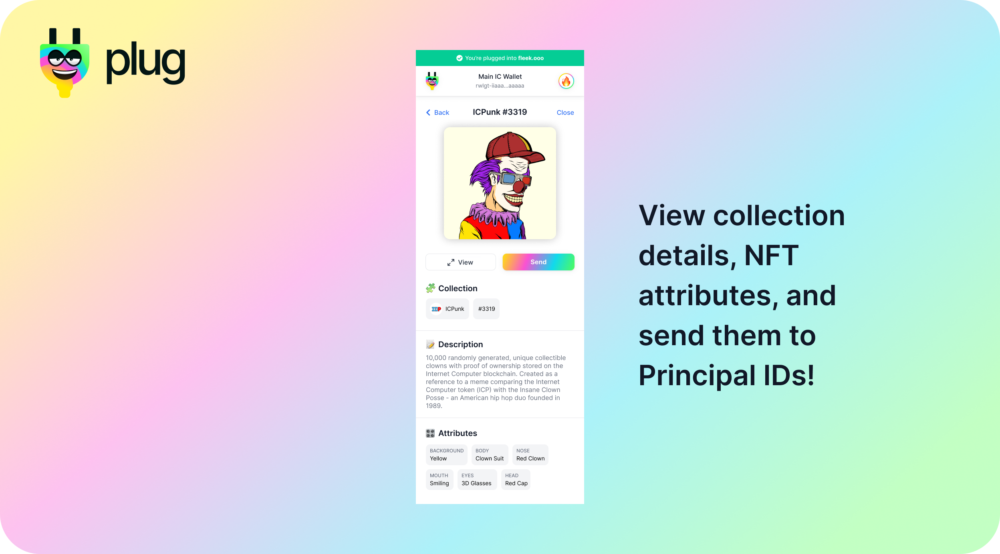

# NFTs in Plug

With Plug, you can view the NFTs held/owned by your Principal ID, view a specific NFT's details and attributes, and send them through Plug's UI to a different Principal ID.

## DAB's NFT List - (DIP721, EXT, and more...)

Plug supports several NFT standards and collections using DAB's NFT list  [(Learn More)](https://dab.ooo/). In a nutshell, DAB is a registry or NFT list for NFTs of any standard that any UI/app (like Plug!) can query to fetch, surface, and integrate many NFT collections at once (instead of manually integrating each one).

Because of DAB and it's standard-agnostic wrapper, Plug is able to confidently scale its support for not only new NFTs but also new NFT standards in the future. Our goal is not to favor any standard, but have an easy way to automatically support many ones at once.

We use the [DAB JS library](https://github.com/psychedelic/dab-js) to support the standards/NFTs in the list.
## Viewing NFT Details & Sending an NFT
To see your NFTs in Plug, click on the NFTs tab from the homescreen.

If your wallet's Principal ID owns an NFT from a collection that's [on DAB's NFT List](https://dab.ooo/nfts/), Plug will auto-surface your owned assets in a list.

If you **click on one of your NFTs** you will enter the **details view**, where you can see the NFT's specific attributes, the collection's details, and more information.

Here you can also use the View button to view the asset on-chain, or **use the SEND button** to transfer your NFT to a different Principal ID.

Want to send an NFT you own to someone else? It is as easy as entering that person's Principal ID, and hitting send. Plug will handle the rest.

## I Can't See My NFT In Plug?

The most likely culprit is that the NFT collection that you're trying to view has not yet been added to DAB's NFT List. 

To double-check if this is the case, visit [DAB's NFT List UI](https://dab.ooo/nfts/) to see the official list of NFT collections that make up the DAB NFT List. If the collection you're trying to view is not on that list, it will not be surfaced in your wallet. You can tell the collection to add themselves to DAB's NFT List [here](https://dab-ooo.typeform.com/nft-list).

**NOTE: This does not mean your NFT is lost - your Plug wallet's Principal ID still owns the NFT and once the collection is added to DAB you'll be able to view and interact with the NFT in your wallet.**

In the case that your collection is listed in DAB's NFT List, please view [our Troubleshooting Guide](../resources/troubleshooting-nfts.md) for more help.