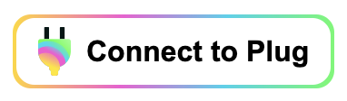
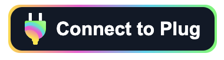

# Plug Authentication Button


The Plug Connect button is a basic React Component button you can use to integrate Plug's `Agent` features for authenticating a user's identity and requesting access to the Plug Agent to sign requests to your canisters on behalf of that identity.

The following example doesn't include the proxy signing requests per-se, just the initial authentication and request for the agent.

You can find the repository of Plug Connect [here](https://github.com/Psychedelic/plug-connect).

## Requirements 🤔

You'll be required to have:

- Basic knowledge of [React](https://reactjs.org/)
- A React >= 16 project to import the [Plug Connect](https://github.com/Psychedelic/plug-connect/packages/919824) package
- A [Github](https://github.com) user account
- Basic knowledge of NPM via the command-line
- [NPM configured](#npm-configuration) to fetch from Github's [@Psychedelic](https://github.com/orgs/Psychedelic/packages) registry


## ⚙️ NPM configuration

The [Plug Connect](https://github.com/Psychedelic/plug-connect/packages/919824) package is in the [Github Package Registry](https://docs.github.com/en/packages/working-with-a-github-packages-registry/working-with-the-npm-registry) and not in the [NPM Registry](https://www.npmjs.com/)! This is important to note as we keep our projects under the [@Psychedelic organisation](https://github.com/psychedelic) on Github, our official channel for our projects.

To pull and install the Plug Connect package from [@Psychedelic](https://github.com/psychedelic) via the NPM CLI, you'll need:

- A personal access token (you can create a personal acess token [here](https://github.com/settings/tokens))
- The personal access token with the correct scopes, **repo** and **read:packages** to be granted access to the [GitHub Package Registry](https://docs.github.com/en/packages/working-with-a-github-packages-registry/working-with-the-npm-registry#authenticating-to-github-packages).

- Authentication via `npm login`, using your Github email for the **username** and the **personal access token** as your **password**:

Once you have those ready, run:

```sh
npm login --registry=https://npm.pkg.github.com --scope=@Psychedelic
```

!!! Note
    
    You only need to configure this once to install the package!
    On npm login provide your Github email as your username and the Personal access token as the password.

## Using the package 🎁

Make sure you have followed the instructions for configuring your [NPM CLI](#npm-configuration), as our packages are hosted outside NPM's registry.

In the project root, create a `.npmrc` file and put the following content:

```sh
@psychedelic:registry=https://npm.pkg.github.com
```

This hints npm to look for **@Psychedelic** in the correct location.

You can then, add the package (we're using yarn but npm can be used):

```
yarn add @psychedelic/plug-connect
```

Once added, you'll be able to import the Plug Connect package by:

```js
import PlugConnect from '@psychedelic/plug-connect';
```

To use the component, do:

```js
<PlugConnect
  whitelist={['canister-id']}
  onConnectCallback={() => console.log("Some callback")}
/>
```

Where **whitelist** is a list of Canister Ids (an Array of strings) and **onConnectCallback** a callback function.

For example, let's say that you want to get the user's identity on connect:

```js
<PlugConnect
  whitelist={['canister-id']}
  onConnectCallback={
    () => console.log(window.ic.plug.agent.getPrincipal())
  }
/>
```

**Connection & Agent Persistence Check**

After integrating the button, **add this check as a fallback to ensure the connection persists and the agent is available at all times** as the user navigates your application/website.

This checks the status of the connection to the user's Plug wallet; if at any given moment it turns into false, it re-requests it. Furthermore, if the connection is true, but the agent is not instantiated or wasn't persisted after a refresh (window.ic.plug.agent = null), it re-instantiates (createAgent) the agent. 

```js
const connected = await window.ic.plug.isConnected();
if (!connected) window.ic.plug.requestConnect({ whitelist, host });
if (connected && !window.ic.plug.agent) {
  window.ic.plug.createAgent({ whitelist, host })
}
```
You can use this, for example, in a ```useEffect``` inside your apps main component (index/app) to do a check after load, or you can run the check before a user executes a Plug/Agent related action. You can pass on the same whitelist as before (won't require re-approval by the user, unless access was revoked), or a different whitelist Canister ID set (will require the user's approval). 

```JS
const verifyConnectionAndAgent = async () => {
  const connected = await window.ic.plug.isConnected();
  if (!connected) window.ic.plug.requestConnect({ whitelist, host });
  if (connected && !window.ic.plug.agent) {
    window.ic.plug.createAgent({ whitelist, host })
  }
};

useEffect(async () => {
  verifyConnectionAndAgent();
}, []);
```


---

Here's how it'll look like in the **default light mode**:

{: style="max-width:220px"}

The props `dark`, `host`, `title` are also supported:

```js
<PlugConnect
  dark
  title="My title"
  onConnectCallback={() => console.log("Some callback")}
  host="host-example"
  whitelist={['canister-id-1', 'canister-id-2']}
/>
```

Here's how it'll look like in **dark mode**:

{: style="max-width:220px"}

## Conclusion

We're currently working hard to bring more features and plan to release them as soon as they become ready.

The project is [open-source](https://github.com/Psychedelic/plug-connect) and you are very welcome to participate or follow the progress!
