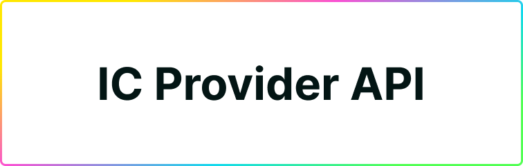

# IC Provider API

**Coming soon, on Plug's V0.2.0 release next week.** Plug is currently in Alpha V0.1.0**, and that early version doesn't include developer integrations / interactions, therefore this documentation is currently a placeholder and doesn't contain Plug's interfaces/guides.