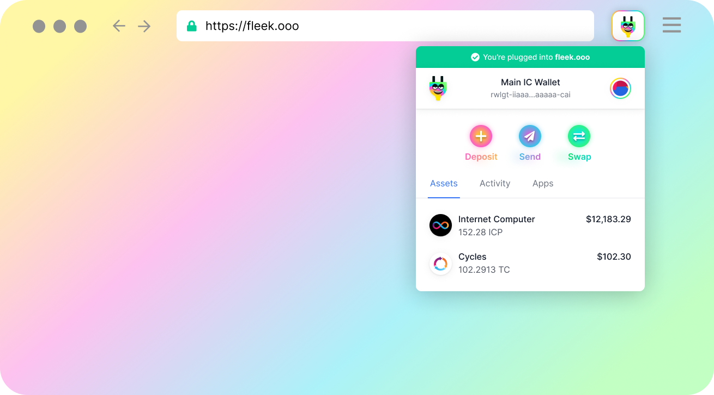
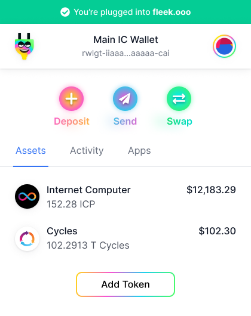
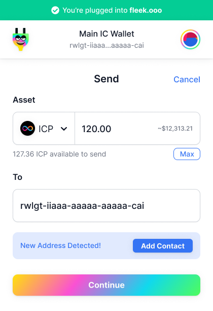
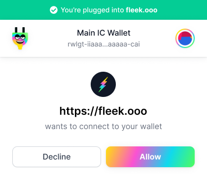
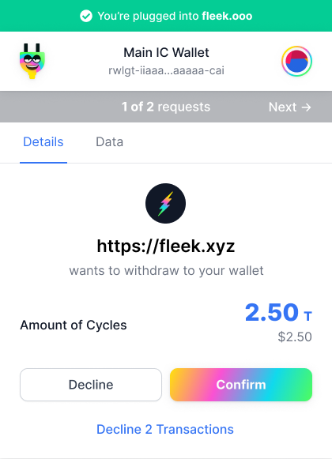
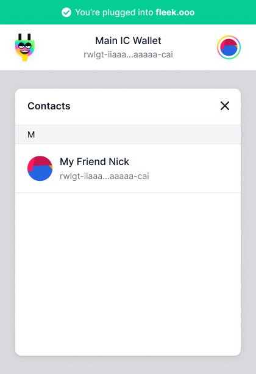

# Sneak Peek!

**Plug is currently in the last stages of development!** But that doesn't mean we can't give you an overview, and quick sneak peek of what Plug will be capable of, right? Jump aboard for a quick tour of what the application will look like.

## What is Plug?

Plug is an Internet Computer crypto wallet browser extension and identity/authentication provider. 

For users, it is a simple way to access, use and manage their IC tokens (Cycles, ICP, and more!) with **only a Principal ID**; an address book for their IC contacts/addresses (canisters or Principal IDs); and an easy way to log into IC applications.

And for developers, it is a simple provider they can **integrate into their IC app** to allow one-step authentication for their users, and trigger transactions easily in-app to their user's balances.

## Your Plug for Cycles, ICP, and more.

Plug allows any user to manage their Cycles and ICP using just a Principal ID. It will also allow anyone to surface any other Internet Computer token that is compatible/approved, or that follows a Principal-ID centric standard token interface.

You can perform the following asset actions in Plug:

- **Deposit**: To deposit cycles, or ICP to your wallet from external sources.
- **Send**: Send cycles or ICP to other addresses.
- **Swap**: Swap your ICP balance for Cycles, using the mint function.

It's as easy as setting the transaction amount, and entering the destination address! Which you can save later in your address book.

## Your Identity on Internet Computer Applications

Plug is an alternative to Internet Identity, as an identity/authentication provider. It will give users and developers a login experience that is more **Web3 friendly**, by allowing users to log into IC apps in one click using the extension, and just a Principal ID. No need for YuBiKey, or Face ID.

Similar to the Dapp/DeFi experience on Ethereum, users can **sign into IC apps that integrate Plug with the same Principal ID and no other address**, and access/use their balances in-app instantly. **To, for example, accept an in-app transaction to pay for a service with cycles!**

Seamless, user-centric, and not app or device specific. By enabling users to use one unique identifier across the network, we can enable spaces like DeFi to grow.

## Your Address Book for the Internet Computer

Plug will integrate an address book feature, allowing any user to keep a record of frequent addresses, friends, or canisters they send cycles/ICP/tokens to. When sending a transaction, you will have access **to your address book**, keeping transactions clean, mistake free, and easy.