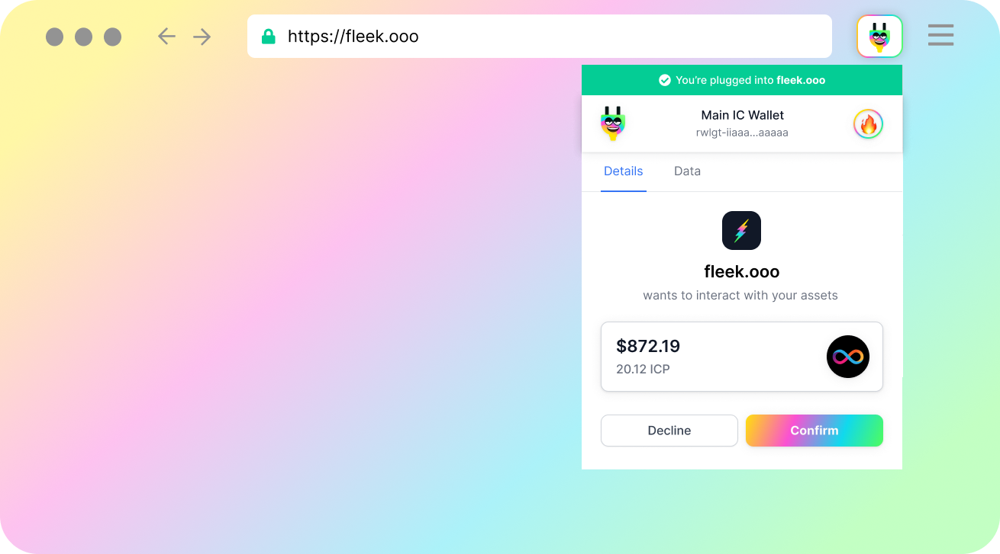

# App Trust, Security, and Safe Practices


If you are here, it is because you've probably seen **a warning message** in Plug while using your wallet in an Internet Computer application.


This error is related to **safe practices when integrating Plug**. We have prepared this guide so users understand **why they see this**, and for **developers of apps showing these warnings** to know how to solve it.

- [**For users**:](#for-users) learn why this happens.
- [**For developers**:](#for-developers) learn how to fix it so your apps doesn't show a warning.

---

## 👤 For Users
### Why are you seeing this error?

You’re seeing this message because an application has tried to interact with one of your assets inside of Plug in **an unsafe manner.** 

Similar to other browser wallets like MetaMask, we ensure that applications cannot interact with your assets **without your explicit permission**. 

However, the application that you’re currently on has **wrongly integrated Plug**, therefore when they request to manage your assets **you can't see the details of their action**.

What is wrong? Instead of **requesting to manage your assets THROUGH PLUG**, the app has requested to **manage them directly**. In both cases, you still have to confirm the action; but since they didn't go through Plug, we can't "read or show" the full details of their actions, which is **not transparent to users**.

### What should this message look like without an error?


When an application is trying to access one of your assets in a safe manner, the pop-up message should look like the one above.

The application has “talked” with Plug to pass the information along about what asset and in what quantity (if it's a fungible token) they are trying to mange with, **so you can approve the action knowing 100% what they are requesting to do**.

### Your Options
You have to decide for yourself if you **trust the application enough** to allow them to perform the action as advertised. 

Since they are not passing in any information to you, the application could be interacting with any asset in any quantity they'd like.

### Suggested Actions

Our suggestion is that you **get in contact with the application and send them this article** so they may also be informed and can take the necessary actions. 

Our next section, ‘For Developers’, will be a guide for them to understand why their users have gotten this message and what they can do to mitigate it from happening in the future.

---

## 🧰 For Developers - How to Fix This
### Why Your Users are Seeing this Message

As a safety measure, Plug requires a **pop-up when your application requests to interact with any canister** that your user holds an asset with in Plug and does **an update call**. 

However, there are **safe practices to follow** when making calls to canisters on behalf of users when integrating Plug. You have to use Plug's **createActor** method so that you can explicitly pass in the information pertaining to the update call (the arguments/parameters), so that Plug can relay this information to the user in the pop-up.

**If you use the Agent in Plug to create your own actor, not using the createActor method**, Plug can't read the parameters/arguments of the update call **and therefore can't show it to the user, reason why it hows them a warning**.

### ⚠️ Example of the WRONG way of doing a call:
In this example, the app, after connecting to the user's wallet, uses the agent to create its own actor, instead of using Plug's createActor.

```js
import XTCIdl from 'route/to/xtc.did.js';

const xtcCanisterId = 'aanaa-xaaaa-aaaah-aaeiq-cai';

// Agent approach (not recommended)
// Plug would not be able to decode the arguments since the IDL
// is not available to the provider and is used locally by the app.
const insecureXTCTransfer = async () => {
  const agent = window?.ic?.plug?.agent;
  const XTCActor = Actor.createActor(XTCIdl, { canisterId: xtcCanisterId });
  const balance = await XTCActor.balance([]);
  console.log('My XTC Balance is ', balance, ' cycles');
  // This is a lie! The user would not be able to see how much it's transferring in the confirmation modal.
  console.log('Transfering 1000 cycles...');
  await XTCActor.transfer({
    to: 'paste-principalID-here',
    amount: BigInt(500000000000),
  });
  console.log('Transfered 1000 cycles');
};
```

###  How to Correctly Make Calls to Canisters With Plug

If you are making canister calls that are resulting in this warning pop-up pop-up, it is **because you are not using Plug’s createActor method**. 

The createActor method requires you to pass in the canisters Candid interface and the canister ID of the canister that you’d like to interact with. 

Once created, you’ll interact with the canister through the actor instance. This actor instance is what allows Plug to **show the user the right information so they can approve/reject the call in the pop-up without warnings**: 

### ✅ Example of how to properly make a call:
In this example, the app uses the createActor method in Plug's IC Provider API to create an actor, therefore when the user **gets the approval pop-up, it will see all information without a warning**.

```js
import XTCIdl from 'route/to/xtc.did.js';

const xtcCanisterId = 'aanaa-xaaaa-aaaah-aaeiq-cai';

// createActor approach (recommended)
// Plug would be able to decode the arguments since it's receiving
// the IDL.
const secureXTCTransfer = async () => {
  const XTCActor = window?.ic?.plug?.createActor(xtcCanisterId, XTCIdl);
  const balance = await XTCActor.balance([]);
  console.log('My XTC Balance is ', balance, ' cycles');

  // If the page were to lie, the user would realize by comparing to what it
  // is being prompted in the confirmation modal.
  console.log('Transfering 1000 cycles...');
  await XTCActor.transfer({
    to: 'paste-principalID-here',
    amount: BigInt(5000000000),
  });
  console.log('Transfered 1000 cycles'); // You would never make it here cause the user would decline the sign
};
```

Check out our documentation or the [NNS stats tutorial](https://docs.plugwallet.ooo/build-an-app-examples/plug-auth-nns/) to learn more about the createActor method.