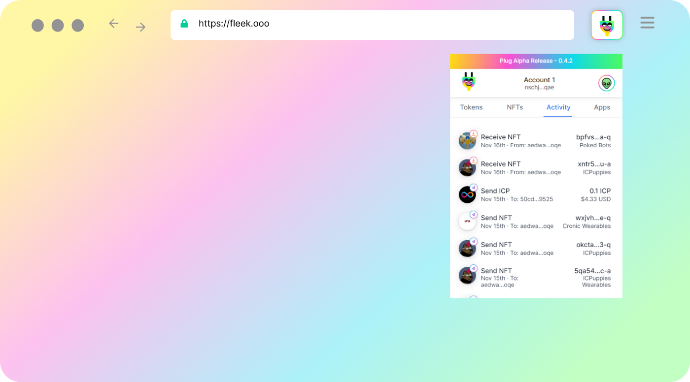

# Asset Activity & History

When using Plug to manage, send, or receive NFTs or Tokens, you will be able to see **the transaction history on the activity tab of your Plug wallet**.

---

In some cases, there might be a scenario where a token or NFT, after a transfer has occured, **does not show an event in the Activity tab**.

## When can this happen?

- When a Token or NFT does not integrate [CAP](https://cap.ooo) for its transaction history.
- When a token, given the condition above, is also not added to the Plug proxy.

Wait, what is CAP or the proxy? Tokens and NFTs on the Internet Computer natively don't have a transaction history. [CAP is a protocol](https://cap.ooo/) that developers can integrate into NFT and Token contracts to give them a scalable history.

Still, when tokens or NFTs supported by Plug don't integrate it, [Plug can act as a proxy to save that transaction data ](https://medium.com/plugwallet/plug-v0-4-2-646548882224?source=collection_home---4------2-----------------------) to CAP in the meantime, until the NFT integrates it. However, there might be a scenario between a new NFT's launch and it being added to Plug's proxy (a manual process at the moment) where the activity does not show.

In those scenarios:

1. Contact the NFT collection creators and let them know their project is not integrated to CAP and therefore does not have provenance/history.

2. Contact the Plug team (via [Twitter](https://twitter.com/plug_wallet) or [Discord](https://discord.gg/psychedelic)) and let us know the collection being affected.