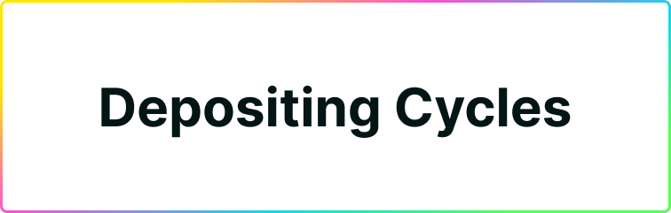
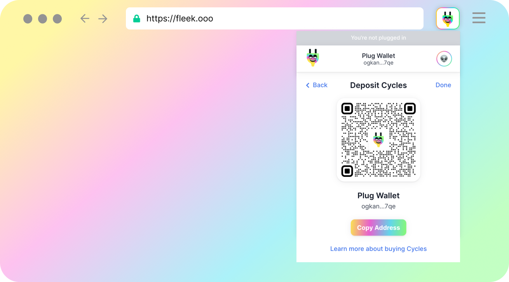
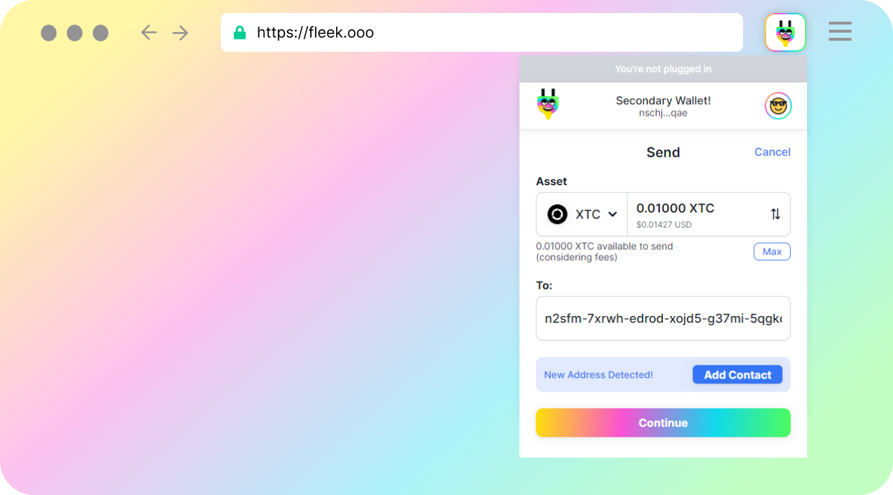
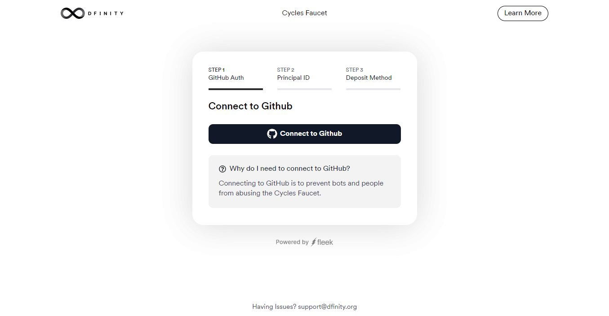

# Depositing/Getting Cycles

Plug supports [Cycles Token (XTC)](https://dank.ooo/xtc/) as a cycles provider in the wallet. Cycles Tokens (XTC) wraps cycles to allow users & developers to hold and use them with just a Principal ID, eliminating the need for multiple unique identifiers & the need for cycles wallets.

## How can you deposit Cycles into Plug with Cycles Token (XTC)?
At the moment, you have three options to get Cycles with XTC.

1. Receive Cycles Token (XTC) from another Plug user.
2. Use the Cycles Faucet to redeem $100 of Cycles Token (XTC).
3. Deposit raw cycles in the XTC Canister, tied to your Plug Principal ID to mint XTC.

Soon, Cycles Token (XTC) and Plug will support ICP to XTC swaps, allow Plug to surface the in-app swap option directly. This is not available yet due to a current technical limitation of the IC that will be soon lifted.

## The Deposit Cycles Screen in Plug

If you select the DEPOSIT button on the main screen, you will see the option screen for depositing Cycles (as Cycles Tokens - XTC) in Plug. There you will have a **QR Code** of your Principal ID, or you can copy the Principal ID directly.

It's **important to remember** that Plug supports cycles using the Cycles Token (XTC). Meaning, you can't receive cycles directly from a cycles wallet/canister, but from sources that support XTC.

----

## 1. Receiving Cycles Tokens (XTC) from another Plug user.

If you send your Principal ID to another Plug user, they can use the SEND button to send you Cycles from their own balance. You will receive Cycles Token (XTC).

From the other person's perspective (the sender), they would see this screen:

----

## 2. Using the Cycles Faucet to Redeem Cycles Token (XTC).

DFINITY's [Cycles Faucet](https://faucet.dfinity.org/) is an open faucet any developer can use to get a one-time redeem of $100 worth of Cycles. 

To get these redeem to your balance in Plug, **select the option to redeem the cycles as Dank/Cycles Token-XTC** option.

Then, when the Cycles Faucet asks for a Principal ID where to receive this Cycles Tokens (XTC), **enter your Plug wallet's main Principal ID** which you can get from the deposit screen.

----

## 3. Minting or Sending Cycles Token (XTC) to your Plug Principal ID Balance.

The final option is interacting with the Cycles Token (XTC) token canister directly. Here you have two options.

The first one, if you have a balance already in Cycles Token (XTC), but want to transfer it to your Plug Principal ID, **you will need to make a transfer request to XTC**. You can find the proper DFX command in [XTC's documentation](https://docs.dank.ooo/xtc/getting-started/#transferring-cycles-to-another-xtc-balance-principal-id-or-canister-id).

The second option is, if you don't have a Cycles Token (XTC) balance already, **to mint XTC and assign it to your Plug Principal ID, by making a raw cycles deposit to the XTC canister**. You can find the proper DFX commands to do so in [XTC's documentation](https://docs.dank.ooo/xtc/getting-started/#depositing-cycles-to-your-cycles-token-xtc-balance).