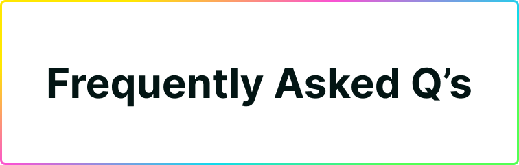
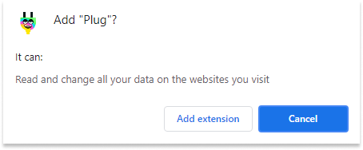

# Frequently Asked Questions (FAQ)

Recurrent doubts, questions, and concerns regarding Plug! If your doubts were not cleared here, feel free to ask in Discord in Twitter; and the team will happily answer.

## Frequently Asked Questions

---

### 1. Is Plug fully open source and verifiable? **YES**

The **entire code of Plug is open source** [and available on GitHub](https://github.com/Psychedelic/plug); not only the extension's code, but the [Plug Controller](https://github.com/Psychedelic/plug-controller) and the [Plug Inpage Provider](https://github.com/Psychedelic/plug-inpage-provider) that power the features in Plug and all its interactions with the Internet Computer.

Anyone is welcome to review and troubleshoot Plug's source code, report issues, and submit improvement ideas or pull requests. All security, permission, and privacy claims are verifiable in the code, and we'll continue to build Plug openly to maintain that.

---

### 2. Does Plug collect any data or information? **NO**

Plug doesn't require any sort of personal information to function, nor it collects or asks any of it to users. 

Plug also doesn't collect any sort of behavior, usage, or browser/website data. The only exception being the current website's name/URL when it needs to be shown in the extension (when you connect to an app/website with Plug, and it shows the website on the Apps list). All of these claims, once again, are verifiable on our [repository](https://github.com/Psychedelic/plug).

---

### 3. Why does Chrome say Plug can read and change data on websites?

When you install Plug from the Chrome Extension store extension, the store will automatically display this pop-up before confirming the installation:

This is an **automatic generic message** the store displays based on Plug's permissions. Plug requires permission to interact with the pages you visit, but only utilizes it to surface the IC Provider API that websites/applications use to integrate Plug.

The API is needed so that websites and apps that want to integrate Plug can detect when the extension is present, and "talk" to it to, for example, authenticate you as a user with your wallet, among other Plug-app features.

This is the same case in MetaMask (uses the Ethereum Provider API) and other browser extensions that expose APIs to allow for easy integration, which display the same message when installed. [Once again, Plug is fully open source](https://github.com/Psychedelic/plug), and every interaction and usage of permissions is verifiable in the source code.

---

### 4. Does Plug support seed/recovery phrases from other wallets? **NO**

Plug only supports 12-word recovery phrases using the SECP256K1 curve. For example, exporting previously existing Plug accounts is possible. If the other wallet follows this standard, it will be compatible.

Currently, you can only import previously existing Plug accounts. You can't import wallets using 24-word seed phrases or a different cryptographic curve.  Plug uses SECP256K1, which was agreed on by the DFINITY Foundation as a future-ready option; and allows Plug the ability to export your Plug identity into DFX.

---

### 5. I installed Plug to connect to an app, but it still takes me to a download page?

If you wanted to use an app that integrates Plug for authentication/sign-up, but didn't have Plug before, when you click the "Connect to Plug" button on the app, it will take you to a download page so that you can install & get Plug. Up until there, everything is good, right?

**After you install Plug, you need to refresh the page/app you were trying to connect to** before having Plug, so that it can **now detect that Plug is installed**.

If after clicking the button, you are taken to a download page, you've most likely haven't refreshed the page yet.