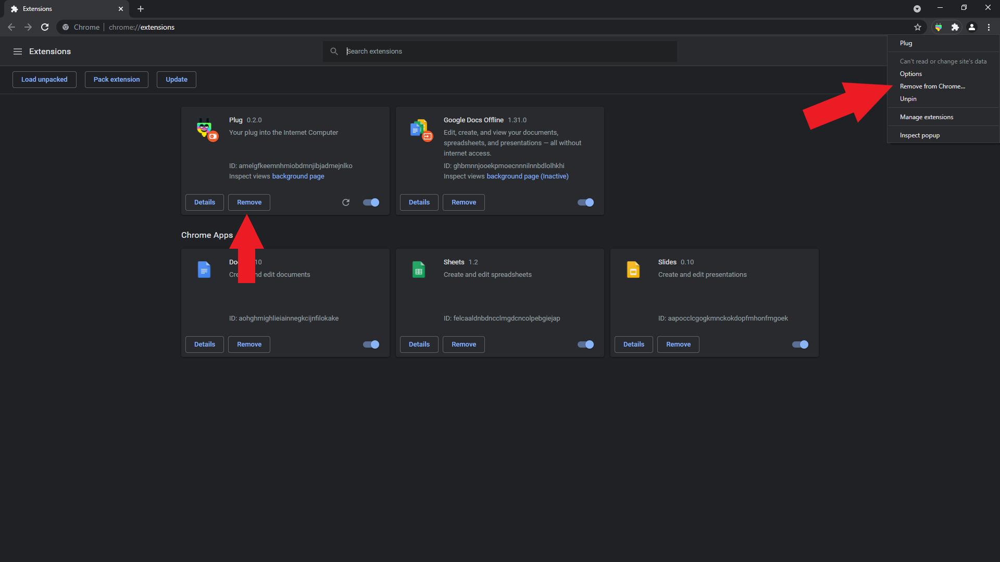
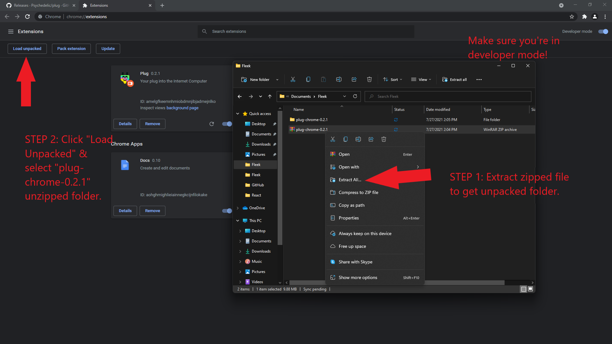
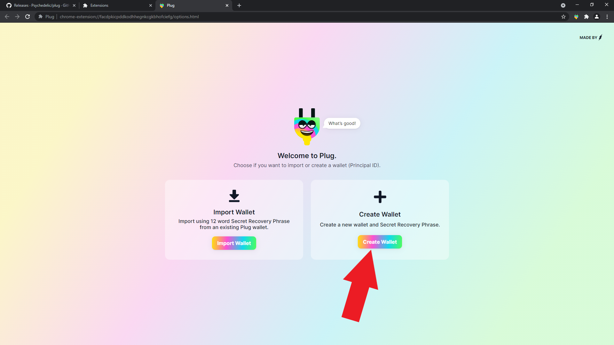
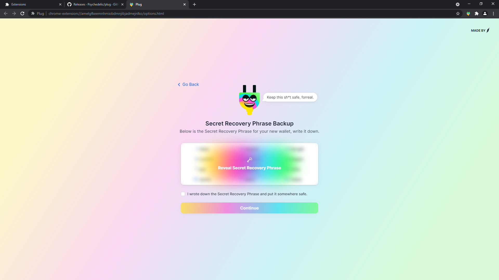
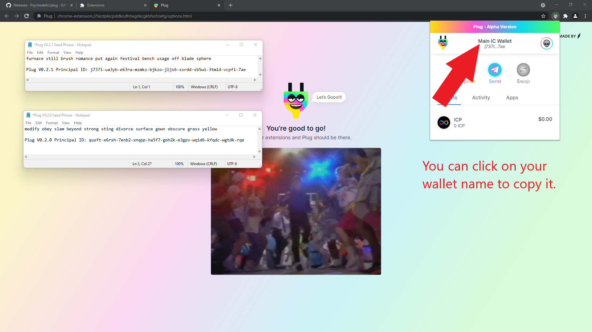
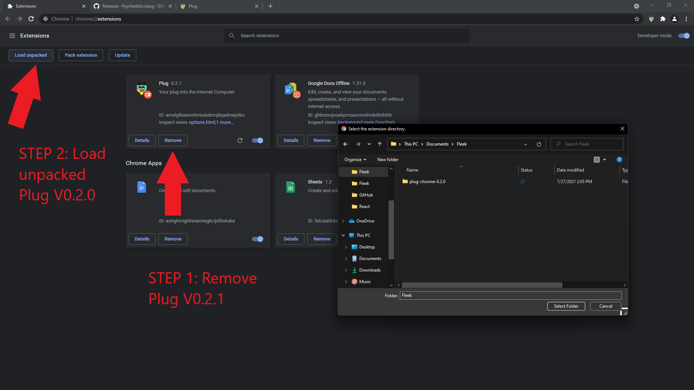
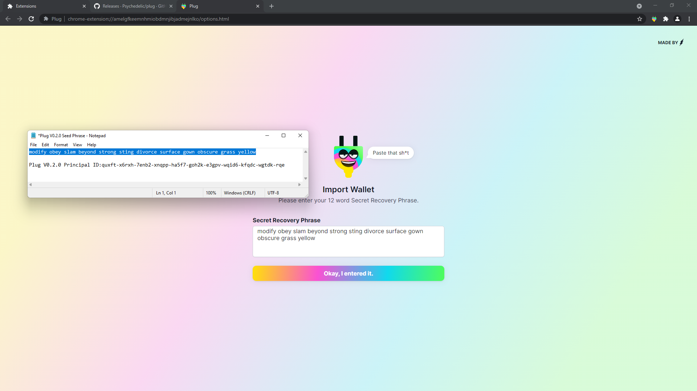
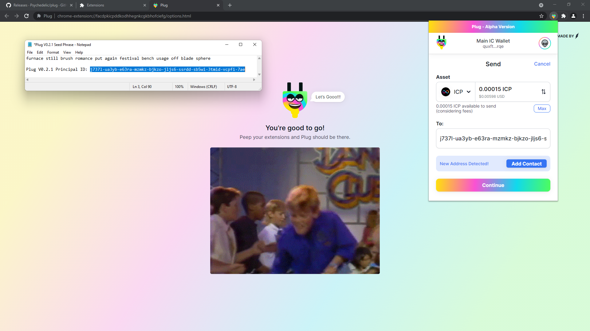
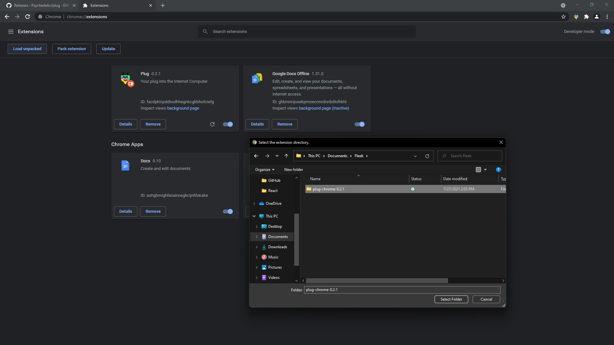
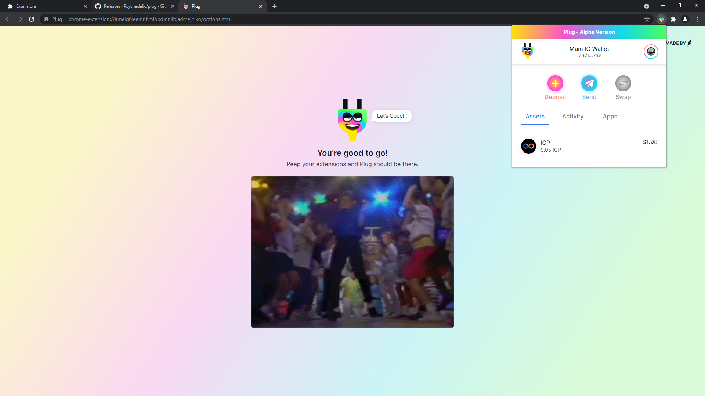

# Migrating Your Wallet to the New Curve

**As of V0.2.1, Plug migrated its curve from Ed25519 to SECP256K1**. This means that the cryptographic curve used to import/create identities in Plug (e.g. the curve used to calculate your Principal ID from your seed phrase) is changing.

**Users with a wallet created in Plug V0.2.0 or before need to create a new wallet in this Plug version and migrate their funds**, because they can’t import their old wallet (since the curve change, the seed phrase would output a different Principal ID/key pair).

**If you had no funds in your Plug wallet yet, you can skip this process and just use a new wallet.**

We’re extremely sorry for the inconvenience. After several discussions with the DFINITY Foundation’s cryptographic team, we agreed that SECP256K1 would have better support in the future on all of DFINITY’s development tools, and can enable Plug to create identities that **can be imported into the DFX CLI, and in turn also import DXF-created identities (Principal IDs) into Plug**.

## How to Migrate Your Old Wallet to V0.2.1 (or up!)

Migrating is a pretty straightforward process. The previous wallet (Principal ID) doesn’t stop existing, you just need to create a new wallet in Plug’s new version, and send your funds over from the old one.

You can do it in one browser, or use two at the same time to make the process a little bit faster. There is a step-by-step guide below with images.

## Migrate Using One Browser

To begin, open the browser where you have Plug installed.

### 1. Uninstall Plug V0.2.0
The first thing you need to do is uninstall Plug’s old version. Remember to save your old wallet’s Seed phrase first. As you will need it later to come back and migrate your funds.

### 2. Download & Install Plug V0.2.1 (or up!)
The second step is to download the latest version of Plug (V0.2.1), and install it.

You can get it from: https://github.com/Psychedelic/plug/releases/

### 3. Create a New Wallet from Scratch (save your new seed phrase!)

Once you have the new version of Plug installed, create a new wallet. This will be your final wallet, the one using the new curve. 

Remember to, as you create your new wallet, to save your seed phrase somewhere safe, cause you will use it later. Unlock Plug with your password and view your new wallet.

### 4. Click your wallet’s name to copy & save your new Principal ID.

Now that you have your new wallet, you should click on your wallet’s name to copy your new Principal ID.

In the image below, you can see we have two docs with our old wallet’s details and seed phrase; and a different one with our new wallet’s details and seed phrase. (The data shown is from a test account).

### 5. Uninstall Plug V0.2.1, and install Plug V0.2.0.

Ok. Now you have your new wallet, and its Principal ID that you will use as the destination of your “send” transaction when you migrate your funds.

Now you need to reinstall Plug V0.2.0 to access your old wallet, and do just that!

Get it from: https://github.com/Psychedelic/plug/releases/tag/0.2.0

### 6. Import your old wallet with your old seed phrase.

To access your old wallet, you will need to select the “import” option after reinstalling Plug, and then use your old wallet’s seed phrase.

### 7. Send your funds from your old wallet to your new Principal ID (saved in step 4).

After you re-log into your old wallet, you can initiate a Send transaction, to send all your funds to your new wallet’s Principal ID. (Remember that ID we saved/copied in step 4?)

It’s as easy as setting the max amount for the transaction, and putting the new Principal ID as the destination address.

Troubleshooting tip: If you make a transaction with ALL your funds (max balance), and it fails, try sending a slightly lower transaction to avoid any issues with the transaction fee not being covered.

### 8. Uninstall V0.2.0 and reinstall V0.2.1

Done! Once your transaction from your old wallet to your new one goes through, you can uninstall V0.2.0 for good, and reinstall V0.2.1.

You can get it from: https://github.com/Psychedelic/plug/releases/

### 9. Import your new wallet's seed phrase, & enjoy your new wallet!

At this point, after installing, you should get back into your new wallet by importing the seedphrase you saved in step 3. Once you do so, you should regain access to your new wallet, and now have your migrated funds! Cheers!

## Migrate Using Two Browsers in Parallel

You can also use two browsers at the same time to make the migration much faster! (e.g. Chrome and Firefox). You can leave the old Plug version in one browser (with your old wallet open), and install the new version in the other, and create the new wallet there. This way you can go through the process in parallel, without having to uninstall-reinstall many times.

1. In browser A, leave Plug V0.2.0 installed and open with your old wallet.
2. In browser B, install Plug V0.2.1 and create a new wallet.
3. In browser B, click your wallet’s name up top to copy & save your new Principal ID.
4. Go to browser A, and transfer your balance (Send) to that new Principal ID.
5. Done! You’ve migrated your funds.

If you have Chrome, you can also use two different [Chrome Profiles](https://support.google.com/chrome/answer/2364824?hl=en&co=GENIE.Platform%3DDesktop) for the same thing, since you can install different extensions on different profiles.