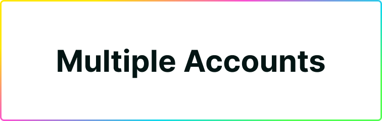

# Recovering Multiple Accounts (Sub-accounts!)

Plug supports creating multiple accounts your main account. Each sub-account has its individual name, Principal ID, and balances; but they **all share the same recovery seed phrase as your main account**.

## How do you recover your sub-accounts after an import?

How do you recover all of your sub-accounts in Plug? Simple! Your main account and all sub-accounts share the same seed phrase. Basically, because Plug derives your sub-accounts from your main account.

However, when you re-import your wallet somewhere else, only your main wallet will appear and sub-wallets won't appear automatically.

Nothing is lost! You'll just need to re-create your sub-accounts after an import (using the "Create Account" button). Since Plug derives sub-accounts from your main one, you'll always regenerate the same sub-accounts, with the same Principal IDs, and same balances as before. Just a matter of re-creating as many as you had before 😎