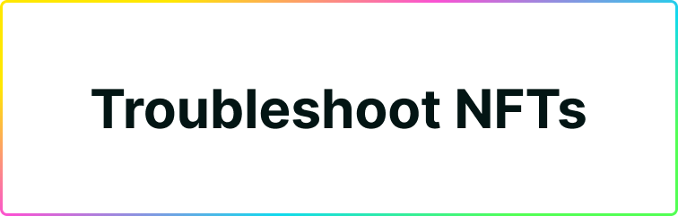

# Troubleshooting

If you’re having trouble with Plug, this guide is meant to address common errors you may see while attempting to load NFTs.

**For issues with other topics, see:**

1. [Troubleshooting Issues with Tokens.](https://docs.plugwallet.ooo/resources/troubleshooting-tokens/)
2. [Troubleshooting General Issues.](https://docs.plugwallet.ooo/resources/troubleshooting-general/)

Please work through this guide before reaching out to support, the first thing our support team will send you is this troubleshooting guide. If you still have issues after trying these steps, contact us.

---

## Why are my NFTs not showing up?

There’s a few reasons why NFTs could be not showing up in your Plug account. 

1. The NFT project is not supported by DAB.
2. DAB is down, unable to fetch the canister registry list for NFTs.  
3. The project’s NFT Canister is down.
4. The Internet Computer Subnet is down. 

To begin troubleshooting, we’ll need to figure out what the error message is by checking background controller logs. To do this, we’ll access the Plug extension **Background Console.**

---

### How to access Plug’s Background Console? 

Press the “Extensions” button in the top right corner of your browser. 
Click “Manage Extensions”
Enable “Developer Mode” in the top right corner of the “Manage Extensions” page. 
Finally, open the console by clicking “background page” next to “Inspect Views” on the Plug extension modal. 

You have successfully opened Plug’s Background Console, **please take note of the error** and continue with the troubleshooting guide below. 

---

### NFT Project Not Supported Error: Not Supported by DAB

If there is no error message at all, it is possible the NFT is still not supported by DAB's NFT list. To solve the problem, reach out to the NFT project team members and ask if they have integrated their NFT project with DAB. 

You may check the list of integrated DAB NFT projects [here.](https://github.com/Psychedelic/dab/blob/main/registries/nft/list.json) 

We’re always adding new projects & standards, reach out to us in Discord and request to get the project added to DAB. 

---

### DAB is Down Error - Error with Canister ID “aipdg-waaaa-aaaah-aaq5q-cai” 

If you se an error message with the Canister ID below, it might mean that DAB is down and unable to fetch the Registry List for NFTs - “DAB Down Error”.

Reach out to the DAB team in our Discord, in the #dab, #plug or #support channel. There’s nothing that can be done from your end as a user to resolve this issue.

Stay up-to-date with us on our Twitter for maintenance updates @plug_wallet & @dab_ooo or alternatively, join our Discord where an announcement will be posted as soon as the issue is resolved.

---

### NFT Collection Canister is Down or Out of Cycles

If there is an error with the NFT project’s Canister ID, it means the project’s NFT Canister is down.

To troubleshoot if the project’s NFT canister is down, follow the steps below: 

1. Visit the NFT project’s GitHub, Website, Discord.
2. Reach out to one of their team members and find their Canister ID.
3. Compare their Canister ID to the errors in the Background Console error logs.
4. If you see the same Canister ID, it means the project’s NFT Canister is down. 

There’s nothing that can be done directly from Plug to troubleshoot this issue, please contact the team of the asset/canister/NFT that isn’t loading for more information and wait for them to bring it back online.

---

### 502/503/504 Errors - Subnet is Down Error

If nothing is loading or showing, you may receive the “Subnet Down” error message, this means that the Internet Computer is currently having some trouble processing requests to the subnet due to a variety of factors such as high traffic, performance upgrades, user throttling, etc.

There’s nothing Plug can do to resolve this issue, please wait until the subnet is brought back online & stay up-to-date with Internet Computer.

You may learn about the status of the Internet Computer here: 
https://status.internetcomputer.org/

---
## FAQs Regarding NFT Management

### How do I send my NFTs to Stoic Wallet or other wallets?
Plug makes sending NFTs very simple, to send your NFT to another IC wallet make sure the following conditions are met. 

The NFT Standard is supported. 
The wallet uses Principal ID. 

Once you have verified that these conditions are met, you may send NFTs by following the instructions below: 

Copy the Principal ID of the wallet you are attempting to send your NFT to. 
Click on the “NFTs” tab and select the NFT you wish to send. 
Click “Send” and paste the Principal ID of the wallet you wish to send to. 

**Once you click “Continue” the NFT will be sent to the other wallet.** Congratulations on sending your NFT successfully using Plug! ✈️

If your issue persists please reach out to us in the #support channel of our Discord with a short explanation of the error, your browser version, and your OS version so we can begin the troubleshooting process and help you resolve the issue. 

You may find the link to our Discord [here](https://discord.gg/fleekhq). 

---

### How do I send my NFT to Plug from Stoic Wallet or other wallets? 
To send your NFT from another IC wallet make sure the following criteria is met:

1. The NFT is supported in Plug. 
2. The wallet you are sending supports sending to a Principal ID. 

Once you have verified the criteria above is met, you may simply **send your NFT to Plug by performing the following steps:**

1. Copy the Principal ID from Plug by clicking the top header. 
2. Select the NFT you wish to send from the other wallet. 
3. Paste your Plug Principal ID, and press “Send”.

Congratulations, you have successfully sent your NFT from another wallet to Plug. We hope you decide to keep it in Plug 😉

---

### I can see my NFT in Entrepot or other apps but not in Plug?

If you are able to see your NFTs in Entrepot, but you cannot see them in Plug, it is possible that:

1. Plug doesn't support that NFT collection yet.
2. There is an error that is impeding the asset from loading.

Please check the sections above to troubleshoot this issue and verify if the NFT is supported or not yet.

---

## My issue still persists or is not covered here!

If your issue persists please reach out to us in the #support channel of our Discord with a short explanation of the error, your browser version, and your OS version so we can begin the troubleshooting process and help you resolve the issue. 

You may find the link to our Discord [here](https://discord.gg/fleekhq).