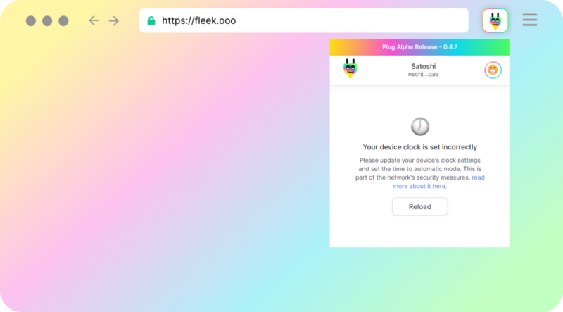
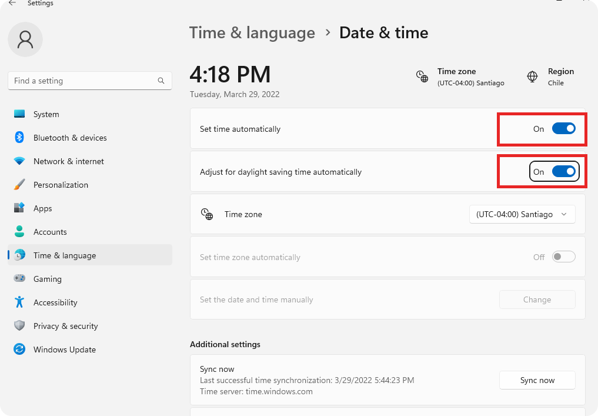
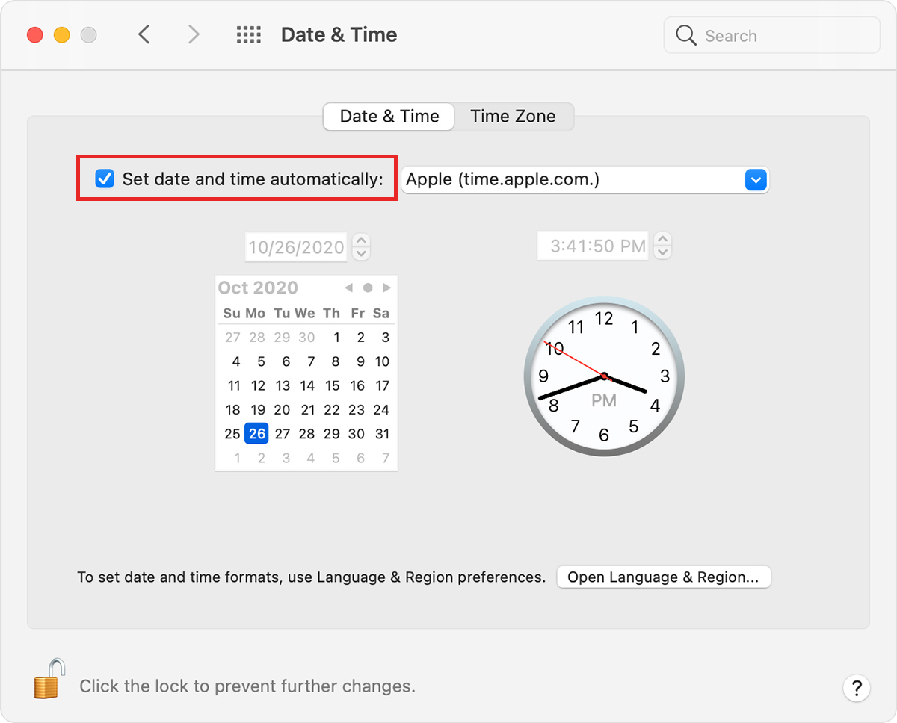

# Troubleshooting - Tokens

If you’re having trouble with Plug, this guide is meant to address common errors related to tokens in your wallet.

Please work through this guide before reaching out to support, the first thing our support team will send you is this troubleshooting guide. If you still have issues after trying these steps, contact us.

**For issues with other topics, see:**

1. [Troubleshooting Issues with NFTs.](https://docs.plugwallet.ooo/resources/troubleshooting-nfts/)
2. [Troubleshooting General Issues.](https://docs.plugwallet.ooo/resources/troubleshooting-general/)

---

## My ICP is not showing but I can see the transaction on activity?

To begin troubleshooting, we’ll need to figure out what the error message is by checking background controller logs. To do this, we’ll access the Plug extension **Background Console**. 

### How to access Plug’s Background Console

Press the “Extensions” button in the top right corner of your browser. 
Click “Manage Extensions”
Enable “Developer Mode” in the top right corner of the “Manage Extensions” page. 
Finally, open the console by clicking “background page” next to “Inspect Views” on the Plug extension modal. 

You have successfully opened Plug’s Background Console, **please take note of the error** and continue with the troubleshooting guide below.

--- 

## “Clock Error” - Code 400: Specified ingress_expiry not within expected range

The Internet Computer is very strict with its security measures to ensure calls/requests made to the network are safe. Because of this, the network uses a user's device clock as a reference to check for **expired calls** and avoid their wrongful execution.

If your computer's clock is wrong, then whenever **Plug tries to "talk" to the IC**, the call is deemed “expired”. This can result in issues like:

- Your balances or NFTs not loading correctly
- Connecting and using dApps with Plug not working

**This will cause Plug to show the error screen above**. If you click the Plug logo on the app extension, **you can still navigate the app**. But the error will pop-up again when you reopen Plug until the issue is resolved (see the guides below)

### Solving Clock Issue (Windows):

Open your device's **Date & Time** settings. You can right click your clock on your task bar to find these settings, or [find it in Settings](https://support.microsoft.com/en-us/windows/how-to-set-your-time-and-time-zone-dfaa7122-479f-5b98-2a7b-fa0b6e01b261#:~:text=In%20Date%20%26%20time%2C%20you%20can,%26%20language%20%3E%20Date%20%26%20time.).

Depending on your region and country, you'll see different toggles. You need to **turn on all those available regarding automatic setting of time, daylight saving time, or time zones**. If one is greyed out (like in the picture above), turn on all those available.

### Solving Clock Issue (macOS):

Open your computer's **Date & Time** settings. For this you can click on your Apple menu (Apple logo), pick System Preferences, and then click Date & Time.

You'll need to **hit the lock to unlock the settings** and be able to modify it. Then, esnure the "Set date and time automatically" **checkbox is marked** as seen in the picture above. And hit the **lock button at the bottom left again to lock the settings and save**.

That is it! Make sure you close & reopen your browser after making this change so that Plug can detect the new time and fix the issue.

---

## Other Error Codes

### Canister Down Error: The Asset's Canister is Unavailable

If you are receiving the “Canister Down” error while for example visiting the Assets tab and not seeing your balances it might be due to the Token's or projects canister being down. 

There’s nothing that can be done directly from Plug to troubleshoot this issue, please contact the team who developed the token that isn’t loading for more information and wait for them to bring it back online.

---

### Subnet Down Error: The Subnet where the Asset Lives is Down

If nothing is loading or showing, you may receive the “Subnet Down” error message, this means that the Internet Computer is currently having some trouble processing requests to the subnet due to a variety of factors such as high traffic, performance upgrades, user throttling, etc.

There’s nothing Plug can do to resolve this issue, please wait until the subnet is brought back online & stay up-to-date with Internet Computer. 

You may learn about the status of the Internet Computer here: https://status.internetcomputer.org/

--- 

## Where can I get ICP and how do I transfer ICP to Plug?

You can purchase ICP on Binance, Coinbase, or any other exchange that has ICP listed. You transfer ICP by going to your exchange withdrawal page, selecting ICP, and withdrawing it to your Plug’s Account ID. 

You may find your Account ID by following the steps below:

1. On your Plug home page, click on “Deposit”
2. Click “Continue” with ICP as the selected asset.
3. Copy the “Account ID”.
4. Paste that ID in the withdrawal field of the exchange.

*Note: Most exchanges use Account ID instead of Principal ID to transfer ICP, to learn more about the difference between Account ID and Principal ID visit our [Internet Identities 101 article](https://medium.com/plugwallet/internet-computer-ids-101-669b192a2ace).*.

---
## My issue still persists or is not covered here!

If your issue persists please reach out to us in the #support channel of our Discord with a short explanation of the error, your browser version, and your OS version so we can begin the troubleshooting process and help you resolve the issue. 

You may find the link to our Discord [here](https://discord.gg/fleekhq).