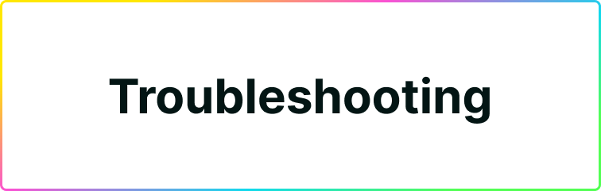

# Troubleshooting

If you’re having trouble with Plug, this sections are meant to address common errors you may see while attempting to load NFTs, tokens, and other assets.

Please work through this guides before reaching out to support, the first thing our support team will send you is this troubleshooting guide. If you still have issues after trying these steps, contact us.

## Is your issue related to NFTs, Tokens, or Other General Issues?

Depending on what type of issue you are encountering, read the proper troubleshooting section:

1. [Troubleshooting Issues with Tokens.](https://docs.plugwallet.ooo/resources/troubleshooting-tokens/)
2. [Troubleshooting Issues with NFTs.](https://docs.plugwallet.ooo/resources/troubleshooting-nfts/)
3. [Troubleshooting General Issues.](https://docs.plugwallet.ooo/resources/troubleshooting-general/)

---

### Still having an issue? Reach out to us on Discord.

If Plug still doesn’t work for you, please reach out to us in our [Discord server](https://discord.gg/yVEcEzmrgm). 

Navigate to our #support channel and send a brief message explaining your problem, your OS version, your browser version, and any additional information/screenshots that might help us troubleshoot your issue. 

---
