# Asset Transactions

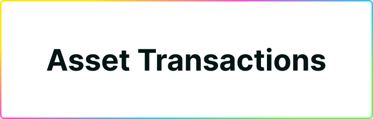

You have an account, you have a balance, now it is time to use it! Send it to another account or canister, or approve transactions.

## Sending Cycles & ICP

To send ICP or Cycles to another account or canister, click **send in Plug's main screen**. This will the send tool, where you can select what asset you want to send:

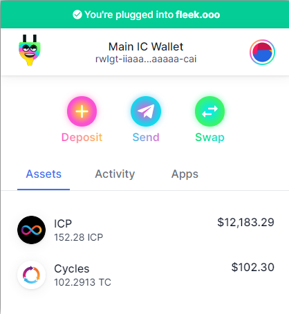

Select the asset you want to send, Cycles or ICP, and enter the amount. Then, you will need to enter an address ID (Principal ID of another Dank Account, or a Cycle Wallet Canister's ID for example).

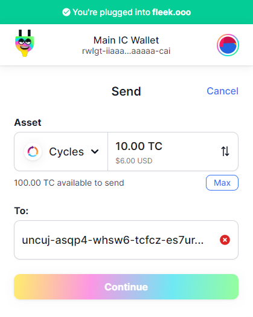

Plug will **detect if the entered address** is a canister or not. If the recipient is a Dank Account, the transaction will continue normally. You will need to confirm the transaction values and recipient, **enter your password** and send.

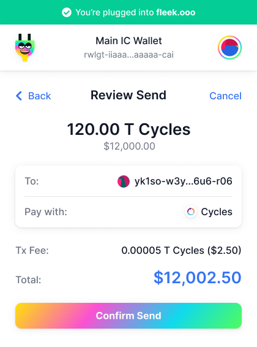

If **the recipient is a canister and you're depositing Cycles**, Plug will detect it and give you two options.

1. To deposit the cycles directly to the canister, withdrawing them from Dank.
2. To 'keep them in Dank' and deposit them in a Dank Account linked to that canister's main IC Principal ID.

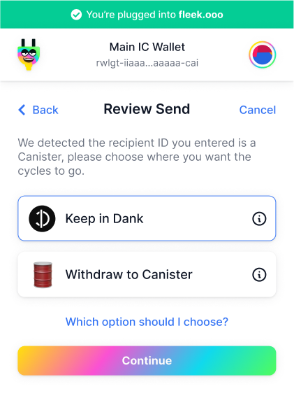

**Which one do you want to use?** It depends. We offer this to be flexible, and allow users to make both direct deposits to canisters or deposit them to the controller's account for them to use via the Dank-to-charging-station-to-canister flow. There is also a different in cost, which we explain below.

### Why Sending Across Dank Accounts is Cheaper

Why when sending cycles to a Canister ID we offer sending them to a Dank account linked to that canister's controller Principal ID?

Because there is a difference in cost when sending cycles across canisters (from Dank to a cycle wallet, or from cycle wallet to cycle wallet) versus **staying inside the Dank ledger, and sending them to another account**.

Why is this? Because Dank Accounts are part of, in a nutshell, a ledger inside a single wallet canister. For Dank, when Plug tells it one of its users wants to send cycles to another user, it is a matter of readjusting those balances internally on the ledger.

## Depositing Cycles to your Account
### From Another Plug Account

If you want to deposit Cycles across Dank accounts, you can click the **deposit button** and select 'Deposit: Cycles' and 'From: Plug Account'.

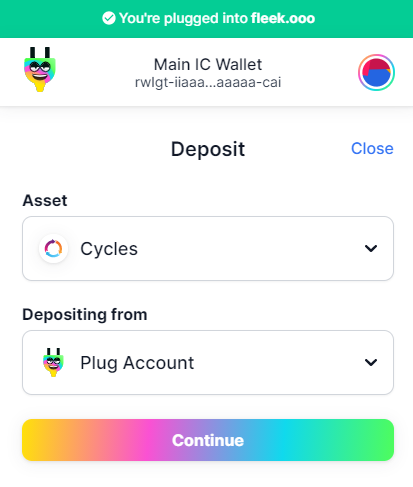

Then it is a matter of **scanning the QR code from the extension, or copy pasting your address**.

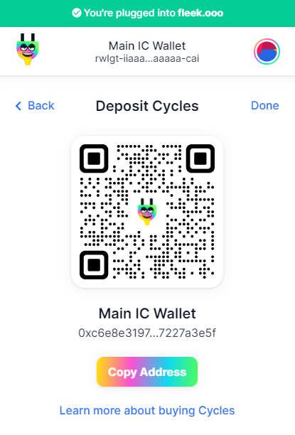

### From a Canister Cycle Wallet

From a canister Cycle Wallet, the process is different. Click **Deposit** and select 'Depositing from: Cycle Wallet'.

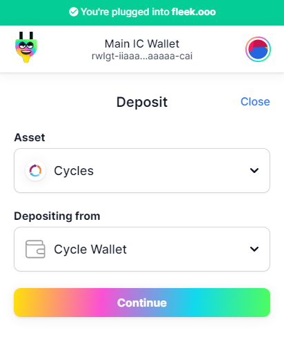

Here, the flow is different. The person making the deposit (you, or a sender) will have to open the DFX CLI tool in DFINITY's Canister SDK, and run a command Plug will pre-build for you that authorize the process.

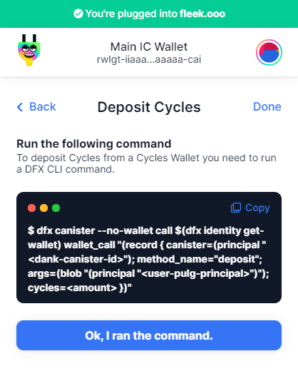

## Swapping ICP for Cycles

The only way to obtain cycles -other from having someone send them to you- is by **minting/swapping them using ICP**. Plug has a built-in swapping tool you can use to convert your ICP balance to cycles in a couple seconds.

**Click Swap** in the main extension screen. The swapping tool will open, showing you your available balance and a field to enter the amount of ICP you want to convert.

**Enter the amount of ICP** you want to swap and click review. **Clicking review won't execute the swap**.

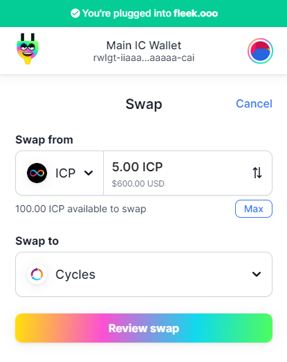

After clicking review, you will move to a confirmation page where Plug shows you the **ICP you will be swapping, its value, and the amount of cycles you get in return**.

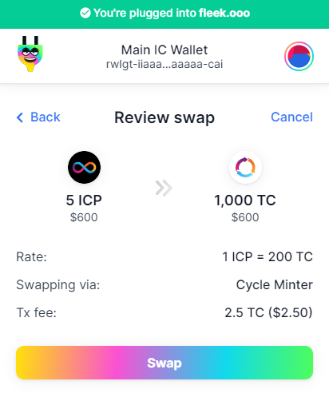

Ready to go? Verify the transaction and once it goes through the network you'll have your cycles ready, and you will be able to see it in the Activity tab.

## Managing Tokens in Plug

This feature will be added to Plug as Plug adds support for Neurons and all other NNS compatible community/app tokens.
