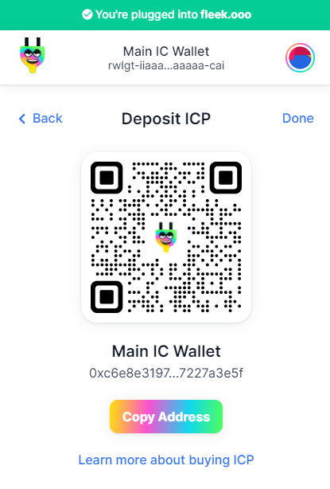

# Buying and Depositing ICP

At the moment you can't buy ICP directly from Plug. You must buy ICP in a trading/exchange platform where it is available **and send it to your Plug account's Principal ID**.

## Buying & Depositing ICP

To get started, click **Deposit** on the main Plug view, and then select ICP as the asset from the dropdown list.

To get started, click **Deposit** on the main Plug view, and then select ICP as the asset from the dropdown list.

Plug will give you a QR you can scan from your trading app, or a way to copy your wallet address to make it quick! 
