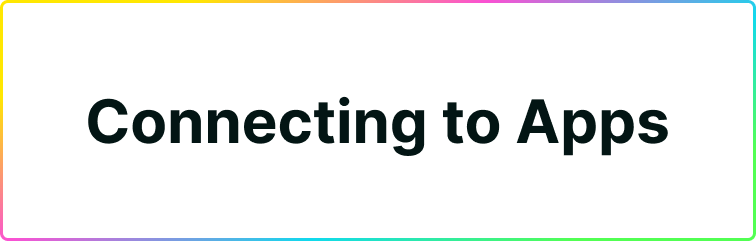
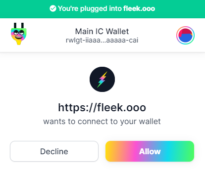
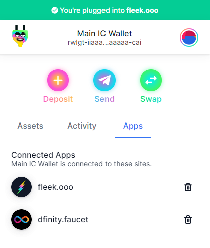
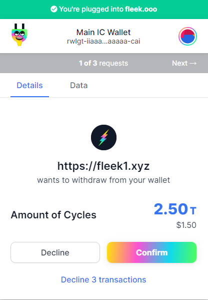

# Connecting to IC Apps

With Plug, you can sign into and authenticate your balance into IC applications in **one step** using our seamless authentication flow. 

## Connecting an App
Found an IC application tha supports Plug as a sign-in provider? Then click **Plug** to get started on their sign up!

If you have the **Plug extension installed and an account created** a pop-up window will appear with a prompt to link the new app/service to your account, which you must confirm.

Hit **allow** and you'll be good to go! The app's interface should reflect the change of Plug having authorized it, signing you into the app with your main IC Principal ID (Dank Account), and displaying your balances immediately in-app.

## Reviewing Linked Apps & Revoking Access
If you go to Plug's main extension screen, you can see an **Apps tab**. Click on it to view all currently linked applications.

You can hit the delete button next to each of their names to revoke access.

## Accepting a Transaction from an IC App

Some IC apps might offer products, services, or include a cycle cost you might need to pay with a transaction. Integrated apps can **trigger transaction to your balance** based on your interaction.

If, for example you wish to access a paid feature or want to subsidize a cost inside the platform, and trigger a purchase/transaction, a pop-up like the following will appear on the extension:

During the transaction, visit the **Data tab** to view the details and parameters of the transaction.

**To confirm a transaction**, simply hit confirm and Plug will deduce the balance from your account and send it to the app's receiving account automatically!
