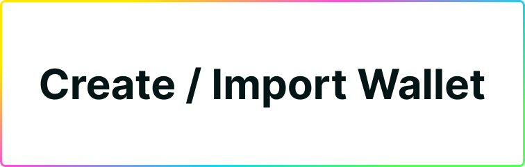
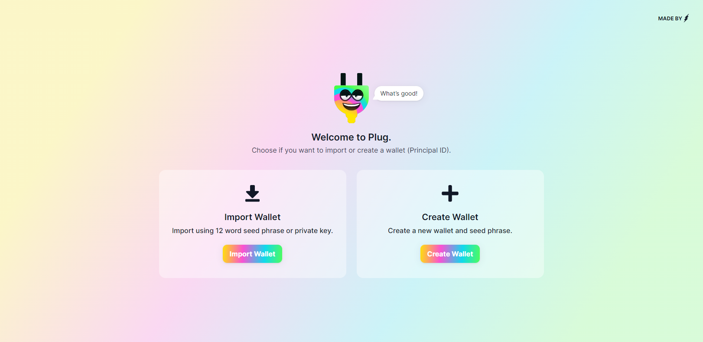
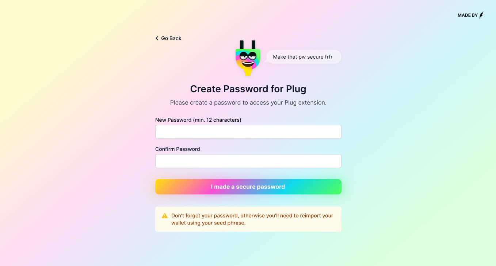
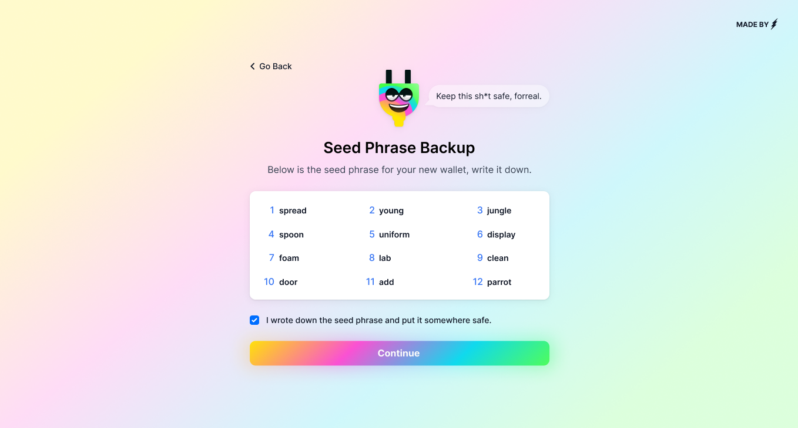
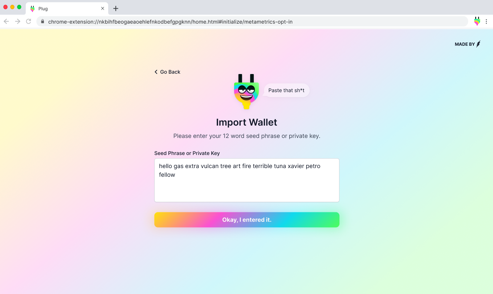

# Creating or Importing a Wallet

New to Plug? You can **create a new wallet, or import an existing one**. Wallets on the Internet Computer are Principal IDs, and Plug can provide you a new one, or you can bring your own via a seed phrase or private key.

## Creating a New Wallet

Get started by downloading and installing the Plug extension for your browser from our [website](https://plugwallet.ooo). Got it installed? Then **select Create Wallet to get started**.

The first step? **Set a password to protect your Plug wallet**. This is the password you will use to unlock the Plug extension, authenticate, and verify changes/transactions if needed.

Second comes your Seed Phrase. Generate a new seed phrase and **write it down, save it on a piece of paper somewhere, and as safe as possible**.

We can't emphasize this enough, your seed phrase is your only recovery option in case you lose access to your wallet. **Don't share it with anyone**, it is the equivalent of the Private Key to your wallet.

**That is all!** It's that quick to get set on Plug, you'll be welcome to your new balance screen.

## Importing or Restoring a Wallet

Already have a Dank Account or a Principal ID wallet you use on the DFX CLI, and want to surface it and manage it via Plug? That's easy, open the extension and select **import wallet instead.**

**This is also the flow for restoring your wallet** on your device if you lost your session, or if you need to take/access your wallet on a new device through Plug. That is why it is important that you **write down and save your seed phrase!**

You'll be prompted to enter your 12 word seed phrase for the Dank Account. Once you complete this process, your wallet will be imported into Plug, and you can continue to **creating a password** and accessing your wallet.

